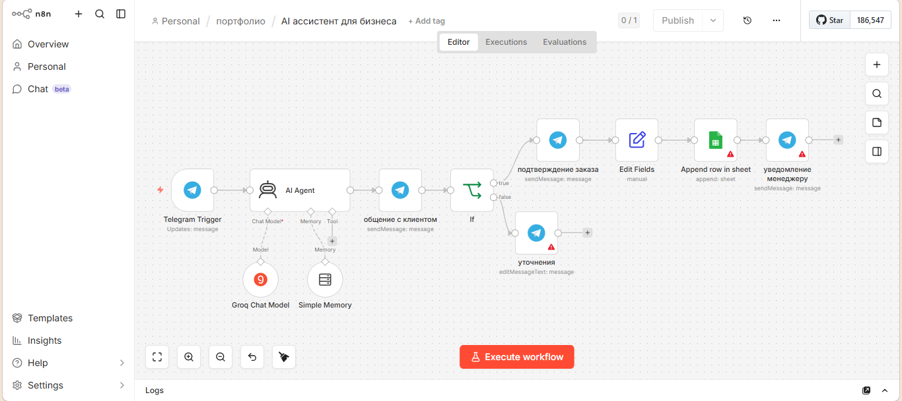

# 🤖 AI-ассистент, который сам закрывает заказы

[🇷🇺 По-русски](#-по-русски) · [🇬🇧 In English](#-in-english)



---

## 🇷🇺 По-русски

### Контекст

Владельцу бизнеса нужен бот, который ведёт клиента от первого сообщения до подтверждения заказа и **сам понимает, когда собрано достаточно данных**, чтобы оформить сделку. Без жёстких скриптов «спросить имя → спросить телефон → спросить адрес» — потому что реальные клиенты редко пишут в удобном порядке.

### Система

```
Telegram Trigger
      ↓
   AI Agent (Groq + Simple Memory)
      ↓
   общение с клиентом
      ↓
      IF
     ↙ ↘
  true   false
   ↓      ↓
подтверждение    уточнения
заказа
   ↓
Edit Fields
   ↓
Append row in sheet
   ↓
уведомление менеджеру
```

1. **Telegram Trigger** — ловит сообщение от клиента.
2. **AI Agent на Groq с Simple Memory** — ведёт диалог, помнит контекст всей сессии. Отвечает клиенту и одновременно решает внутренне: «хватит ли мне данных, чтобы закрыть заказ?»
3. **Сообщение клиенту** (узел «общение с клиентом») — отправляется всегда, независимо от того, закрывается ли заказ.
4. **IF** — читает решение агента:
   - Если агент сказал «пора подтверждать» → ветка `true`: клиенту уходит подтверждение заказа, Edit Fields структурирует данные, Append row in sheet пишет в Google Sheets, отдельное уведомление — менеджеру в Telegram.
   - Если агент решил, что данных не хватает → ветка `false`: бот задаёт уточняющий вопрос (Edit Message Text).

### Что интересно

**Решение «разговор → подтверждение» принимает LLM, а не if-else на ключевых словах.** Сценарий не ломается на «нестандартных» клиентах, которые пишут свободным текстом. В отличие от ботов на шаблонных диалогах, тут клиент может написать «хочу два латте, завтра к 10 утра на адрес такой-то» — и бот поймёт, что данных достаточно, сразу оформит заказ, не задавая лишних вопросов.

**Уведомление менеджеру — отдельный узел после записи в Sheets.** Если упадёт Telegram API менеджера — это не остановит подтверждение клиенту и запись заказа в базу. Клиентский путь защищён от проблем внутренней инфраструктуры.

**Simple Memory, а не внешняя база.** Для bounded-сессии «один заказ — один диалог» этого достаточно. Усложнять имеет смысл, когда появится сценарий «вернуться к клиенту через неделю» — тогда надо уходить на Postgres/Redis.

### Стек

- `n8n` — оркестратор
- `Groq` — LLM (llama-3.3-70b-versatile)
- Simple Memory — in-memory контекст сессии
- `Telegram Bot API` — канал общения с клиентом и менеджером
- `Google Sheets` — база заказов

### Credentials, которые нужно настроить

- Telegram Bot (клиентский бот)
- Telegram Bot (или тот же, с chat_id менеджера)
- Groq API key
- Google Sheets OAuth2

### Как запустить

1. `Workflows → Import from File` → выбрать [`workflow.json`](./workflow.json).
2. Настроить credentials.
3. В узле «уведомление менеджеру» поменять `chat_id` на свой.
4. В узле «Append row in sheet» подключить свою таблицу.
5. Activate.

---

## 🇬🇧 In English

### Context

A business owner needs a bot that walks the customer from the first message to order confirmation and **figures out on its own when it has enough data** to close the deal. No rigid "ask name → ask phone → ask address" script, because real customers rarely volunteer information in a convenient order.

### System

```
Telegram Trigger
      ↓
   AI Agent (Groq + Simple Memory)
      ↓
   chat with customer
      ↓
      IF
     ↙ ↘
  true   false
   ↓      ↓
order          follow-up
confirmation   question
   ↓
Edit Fields
   ↓
Append row in sheet
   ↓
notify the manager
```

1. **Telegram Trigger** — picks up the customer's message.
2. **AI Agent on Groq with Simple Memory** — runs the conversation, remembers the full session. Replies to the customer and internally decides: "do I have enough data to close this order?"
3. **Reply to customer** (the "chat with customer" node) — sent unconditionally, regardless of whether the order is ready to close.
4. **IF** — reads the agent's decision:
   - Agent says "time to confirm" → `true` branch: the customer gets an order confirmation, Edit Fields normalises the data, Append row in sheet writes to Google Sheets, and a separate notification goes to the manager in Telegram.
   - Agent decides there's not enough data → `false` branch: the bot asks a clarifying question (Edit Message Text).

### What's interesting

**The "chat → confirm" decision is made by the LLM, not by an if-else on keywords.** The flow doesn't break on non-standard customers who write in free form. Unlike template-driven bots, here the customer can say "two lattes, tomorrow 10am, delivery to this address" — and the bot realises it has enough data, closes the order, and doesn't ask redundant questions.

**Manager notification is a separate node after the Sheets write.** If the manager's Telegram API fails, it doesn't block the confirmation to the customer or the order record. The customer journey is isolated from internal infrastructure issues.

**Simple Memory rather than an external store.** For a bounded "one order = one dialogue" session that's enough. It's worth upgrading when a "reach out to the customer a week later" scenario appears — then you move to Postgres/Redis.

### Stack

- `n8n` — orchestrator
- `Groq` — LLM (llama-3.3-70b-versatile)
- Simple Memory — in-memory session context
- `Telegram Bot API` — customer and manager channel
- `Google Sheets` — order database

### Credentials to configure

- Telegram Bot (customer-facing)
- Telegram Bot (same or another, with the manager's chat_id)
- Groq API key
- Google Sheets OAuth2

### How to run

1. `Workflows → Import from File` → pick [`workflow.json`](./workflow.json).
2. Configure the credentials.
3. In the "notify the manager" node, set your own `chat_id`.
4. In the "Append row in sheet" node, connect your spreadsheet.
5. Activate.
