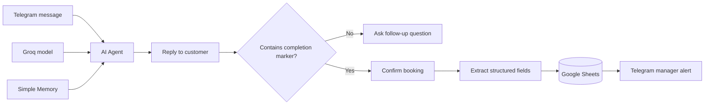
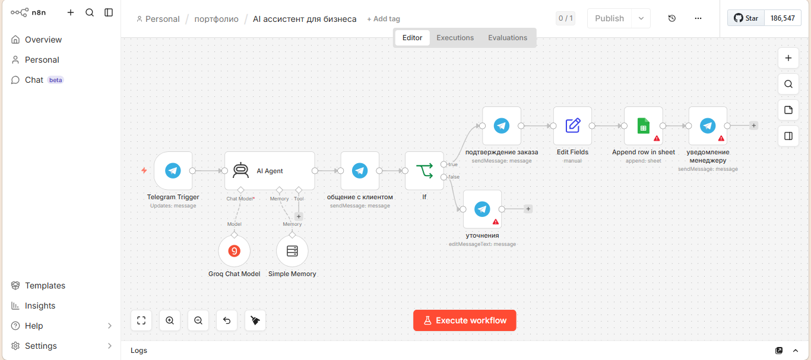

# AI Sales Assistant — Telegram Order Capture

A conversational n8n workflow that collects booking details in Telegram, persists a structured order, and notifies a manager.

[Workflow export](./workflows/ai-sales-assistant.json) · [Sample conversation](./examples/sample-conversation.md) · [Test scenarios](./tests/TEST_CASES.md)

> Scope: portfolio demonstration. The workflow uses an LLM completion marker and in-memory conversation context; it is not a transactional order system.

## Business problem

Customers often provide booking details in an unpredictable order. A rigid question-by-question bot creates unnecessary friction, while an unconstrained chat model can confirm an incomplete request.

The operator needs a structured order containing the customer, service, specialist, appointment time, phone, and email—not a raw chat transcript.

## Solution

The Telegram trigger starts an AI-assisted conversation. Simple Memory keeps a short context window per Telegram chat. The model asks for missing information and emits an exact `ЗАПИСЬ:` marker only when it believes the required fields are present.

A deterministic IF node detects that marker. The completion branch extracts fields, appends a Google Sheets row, and sends a manager notification; otherwise the workflow continues the clarification loop.

## Architecture


```mermaid
flowchart LR
    TG[Telegram message] --> Agent[AI Agent]
    Model[Groq model] --> Agent
    Memory[Simple Memory] --> Agent
    Agent --> Reply[Reply to customer]
    Reply --> Ready{Contains completion marker?}
    Ready -->|No| FollowUp[Ask follow-up question]
    Ready -->|Yes| Confirm[Confirm booking]
    Confirm --> Parse[Extract structured fields]
    Parse --> Sheets[(Google Sheets)]
    Sheets --> Manager[Telegram manager alert]
```

## Workflow screenshots / Output evidence



Synthetic output: [`examples/structured-order.json`](./examples/structured-order.json).

## Key engineering decisions

- AI handles free-form conversation and semantic completeness assessment.
- Routing remains deterministic: the IF node looks for one explicit completion marker.
- Memory is keyed by Telegram chat ID and limited to ten messages, which bounds context size.
- The public prompt contains configuration placeholders rather than a real address or service catalog.
- Persistence occurs before the manager notification, so the order row is the primary side effect.

## Input and output contract

**Trigger:** Telegram text message.

**Required business fields:** customer name, service, specialist, date/time, phone, and email.

**Model completion contract:**

```text
ЗАПИСЬ: имя=xxx | услуга=xxx | мастер=xxx | дата=xxx | телефон=xxx | email=xxx
```

**Business output:** one Google Sheets row plus a Telegram manager notification.

## Failure handling

- Missing information stays on the clarification path.
- Off-topic questions are restricted by the system prompt.
- A malformed completion marker can break the current split expressions; this is documented as a limitation rather than hidden.
- Google Sheets and Telegram errors remain visible in n8n execution history.
- There is no centralized Error Workflow or compensating action in this demonstration.

## Repository structure

```text
01-ai-sales-assistant/
├── README.md
├── workflows/ai-sales-assistant.json
├── screenshots/workflow-overview.png
├── examples/
└── tests/TEST_CASES.md
```

## Setup

1. Import [`ai-sales-assistant.json`](./workflows/ai-sales-assistant.json).
2. Configure Telegram, Groq, and Google Sheets credentials in n8n.
3. Replace `YOUR_BUSINESS_ADDRESS`, `YOUR_BUSINESS_HOURS`, `YOUR_SERVICE_CATALOG`, `YOUR_TELEGRAM_CHAT_ID`, and `YOUR_GOOGLE_SHEET_ID`.
4. Map the target sheet columns to the structured fields.
5. Run the manual scenarios before activating the workflow.

## Test scenarios

The manual coverage includes incomplete conversations, malformed model output, external integration failures, and session isolation. See [`tests/TEST_CASES.md`](./tests/TEST_CASES.md).

## Known limitations

- Simple Memory is not durable across every restart or long-lived customer journey.
- Completion parsing depends on exact delimiters instead of a schema validator.
- The workflow does not prevent duplicate orders or validate schedule availability.
- A Sheets write followed by a failed Telegram alert is not rolled back.

## Production hardening path

- replace delimiter parsing with structured model output validation;
- persist conversation state in Redis or PostgreSQL;
- add an idempotency key and unique storage constraint;
- validate service availability and permissions deterministically;
- add centralized error handling, operator alerts, and redacted audit logs;
- add contract and concurrency tests.

## Tech stack

`n8n` · `Telegram Bot API` · `Groq` · `Simple Memory` · `Google Sheets`

---

## Русская версия

Демонстрационный Telegram-ассистент ведёт свободный диалог, собирает параметры записи и переводит разговор в структурированную заявку. LLM отвечает за смысловую часть, а переход к сохранению выполняется детерминированно по явному маркеру.

Сильная сторона проекта — разделение разговора, краткосрочного контекста, записи в таблицу и уведомления менеджера. Ограничения указаны прямо: Simple Memory недолговечна, парсинг формата хрупкий, а идемпотентность и проверка расписания пока не реализованы.
