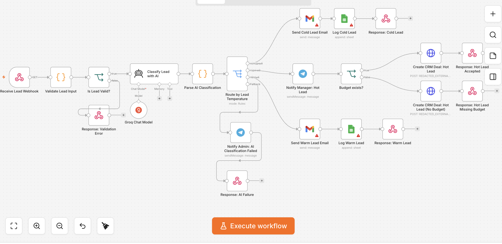
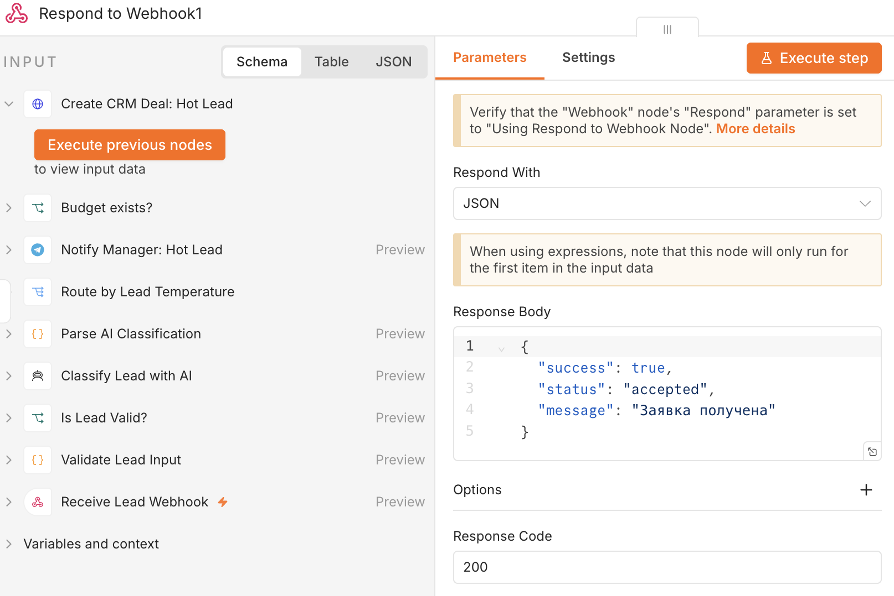
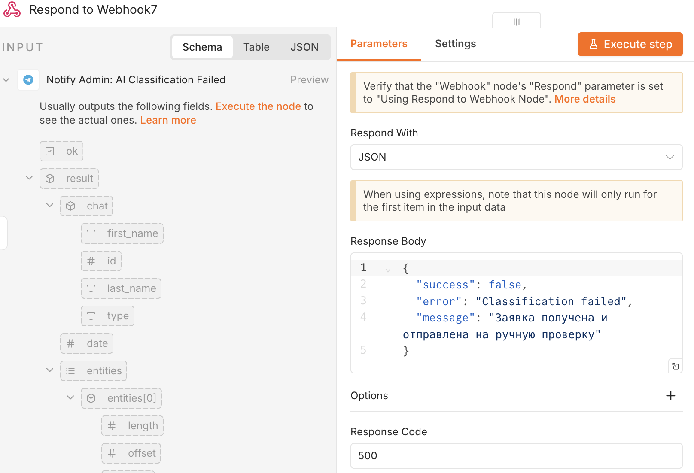
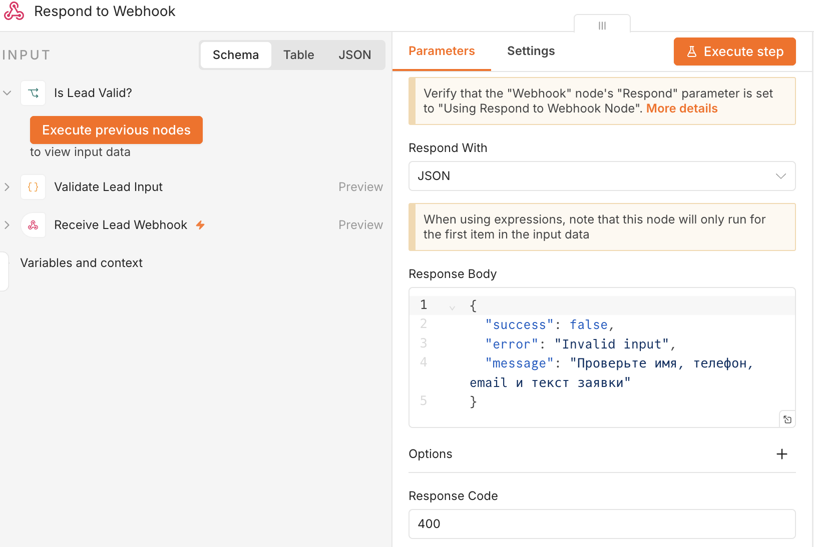

# AI Lead Processing Pipeline

   

## Description

Production-oriented n8n workflow for automated lead qualification and routing.

The workflow receives incoming leads through a Webhook, validates input data, classifies requests with AI, extracts budget values from natural language, and routes leads through different processing scenarios depending on lead temperature.

The project demonstrates production-ready workflow architecture with validation, AI fallback handling, structured parsing, CRM integration, notifications, and explicit webhook responses.

---

## Business Problem

Sales managers often waste time manually reviewing incoming leads:

- who is ready to buy now;
- who needs additional information;
- who is only exploring;
- which request should be prioritized first.

This workflow automates initial lead qualification and helps teams react faster to high-priority customers.

---

## Features

- receives leads through Webhook;
- validates:
  - name;
  - email;
  - phone;
  - request;
  - webhook secret;
- rejects invalid requests before AI processing;
- classifies leads with AI Agent;
- uses deterministic AI settings (`temperature: 0`);
- parses and validates AI JSON output;
- normalizes AI responses (`теплый` → `тёплый`);
- extracts budgets from natural language:
  - `50к`
  - `50 тыс`
  - `1.5 млн`
- routes leads through Switch:
  - hot;
  - warm;
  - cold;
  - fallback;
- sends Telegram notifications for hot leads;
- creates CRM deals through Bitrix24 REST API;
- sends email follow-ups;
- logs leads to Google Sheets;
- handles AI failures safely through fallback routes;
- returns explicit Webhook responses:
  - `200`
  - `400`
  - `500`

---

## Tech Stack

- n8n
- Webhook
- AI Agent
- Groq Chat Model
- JavaScript Code nodes
- IF / Switch
- Telegram
- Gmail
- Google Sheets
- Bitrix24 REST API

---

## Architecture

```text
Webhook
→ Validate Lead Input
→ AI Classification
→ Parse & Normalize AI Output
→ Route by Temperature

Cold lead
→ Email
→ Google Sheets
→ Response 200

Warm lead
→ Email
→ Google Sheets
→ Response 200

Hot lead
→ Telegram notification
→ Budget check
→ CRM Deal
→ Response 200

AI fallback
→ Admin Telegram Alert
→ Response 500

Invalid input
→ Response 400
```

---

## Example Input

```json
{
  "name": "Anton",
  "email": "anton@example.com",
  "phone": "+79990000000",
  "request": "Need automation for clothing business, budget 50k",
  "secret": "DEMO_SECRET_REPLACE_ME"
}
```

---

## Example Output

```json
{
  "name": "Anton",
  "email": "anton@example.com",
  "phone": "+79990000000",
  "budget": 50000,
  "temperature": "горячий",
  "reason": "Client specified a clear task and budget.",
  "next_action": "Send the lead to the manager immediately"
}
```

---

## Production-Oriented Logic

The workflow includes several production-focused patterns:

- strict input validation before AI;
- webhook secret protection;
- deterministic AI classification;
- strict AI JSON parsing;
- normalization of AI output;
- fallback routing for invalid AI responses;
- separate CRM logic for leads with and without budget;
- explicit webhook responses for all routes;
- safe public export without real credentials.

---

## Security

The public version does not include:

- real API keys;
- Telegram chat IDs;
- Webhook URLs;
- CRM credentials;
- Google Sheets IDs;
- personal data.

Before running the workflow, replace:

- `REDACTED_WEBHOOK_PATH`
- `REDACTED_EXTERNAL_URL`
- `TELEGRAM_CHAT_ID_PLACEHOLDER`
- demo secret value `DEMO_SECRET_REPLACE_ME`
- n8n credentials

---

## How to Run

1. Import the workflow JSON into n8n.
2. Add credentials for:
   - Groq
   - Telegram
   - Gmail
   - Google Sheets
   - Bitrix24
3. Replace demo placeholders.
4. Send test requests through Postman or Webhook test URL.
5. Test all scenarios:
   - invalid input;
   - hot lead;
   - warm lead;
   - cold lead;
   - AI fallback.
6. Activate the workflow.

---

## Possible Improvements

- move secret to environment variables;
- add Error Workflow;
- add retry logic;
- add UTM tracking;
- add deduplication by email or phone;
- add lead scoring;
- add analytics dashboard;
- store leads in Supabase or PostgreSQL.

---

# Русская версия

## Описание

Production-oriented workflow на n8n для автоматической квалификации и маршрутизации лидов.

Workflow принимает заявки через Webhook, валидирует входные данные, классифицирует заявки через AI, извлекает бюджет из обычного текста и направляет лидов по разным сценариям обработки в зависимости от температуры заявки.

Проект демонстрирует production-подход к построению workflow: validation, fallback-обработка AI, structured parsing, CRM-интеграция, уведомления и явные webhook responses.

---

## Бизнес-задача

Менеджеры по продажам часто тратят время на ручной разбор входящих заявок:

- кто готов купить прямо сейчас;
- кому нужна дополнительная информация;
- кто просто интересуется;
- какую заявку нужно обработать в первую очередь.

Workflow автоматизирует первичную квалификацию лидов и помогает быстрее реагировать на приоритетных клиентов.

---

## Возможности workflow

- принимает заявки через Webhook;
- валидирует:
  - имя;
  - email;
  - телефон;
  - текст заявки;
  - webhook secret;
- отклоняет невалидные запросы до AI;
- классифицирует лидов через AI Agent;
- использует deterministic AI settings (`temperature: 0`);
- парсит и проверяет AI JSON;
- нормализует AI-ответы (`теплый` → `тёплый`);
- извлекает бюджет из текста:
  - `50к`
  - `50 тыс`
  - `1.5 млн`
- маршрутизирует лидов через Switch:
  - горячий;
  - тёплый;
  - холодный;
  - fallback;
- отправляет уведомления в Telegram;
- создаёт сделки в CRM через Bitrix24 REST API;
- отправляет email-письма;
- записывает лидов в Google Sheets;
- безопасно обрабатывает AI-ошибки через fallback-ветку;
- возвращает явные webhook responses:
  - `200`
  - `400`
  - `500`

---

## Стек

- n8n
- Webhook
- AI Agent
- Groq Chat Model
- JavaScript Code nodes
- IF / Switch
- Telegram
- Gmail
- Google Sheets
- Bitrix24 REST API

---

## Архитектура

```text
Webhook
→ Validate Lead Input
→ AI Classification
→ Parse & Normalize AI Output
→ Route by Temperature

Cold lead
→ Email
→ Google Sheets
→ Response 200

Warm lead
→ Email
→ Google Sheets
→ Response 200

Hot lead
→ Telegram notification
→ Budget check
→ CRM Deal
→ Response 200

AI fallback
→ Admin Telegram Alert
→ Response 500

Invalid input
→ Response 400
```

---

## Пример входящих данных

```json
{
  "name": "Антон",
  "email": "anton@example.com",
  "phone": "+79990000000",
  "request": "Нужна автоматизация для магазина одежды, бюджет 50к",
  "secret": "DEMO_SECRET_REPLACE_ME"
}
```

---

## Пример результата

```json
{
  "name": "Антон",
  "email": "anton@example.com",
  "phone": "+79990000000",
  "budget": 50000,
  "temperature": "горячий",
  "reason": "Клиент указал конкретную задачу и бюджет.",
  "next_action": "Передать заявку менеджеру"
}
```

---

## Production-подход

Workflow использует production-oriented практики:

- строгая validation до AI;
- защита webhook через secret;
- deterministic AI classification;
- строгий parsing AI JSON;
- нормализация AI-ответов;
- fallback-ветки для AI ошибок;
- отдельная логика CRM для лидов с бюджетом и без;
- явные webhook responses для всех веток;
- безопасный публичный экспорт без credentials.

---

## Безопасность

Публичная версия workflow не содержит:

- реальные API keys;
- Telegram chat IDs;
- webhook URLs;
- CRM credentials;
- Google Sheets IDs;
- персональные данные.

Перед запуском замените:

- `REDACTED_WEBHOOK_PATH`
- `REDACTED_EXTERNAL_URL`
- `TELEGRAM_CHAT_ID_PLACEHOLDER`
- demo secret value `DEMO_SECRET_REPLACE_ME`
- n8n credentials

---

## Как запустить

1. Импортировать workflow JSON в n8n.
2. Подключить credentials:
   - Groq
   - Telegram
   - Gmail
   - Google Sheets
   - Bitrix24
3. Заменить demo placeholders.
4. Отправить тестовые запросы через Postman или Webhook test URL.
5. Проверить все сценарии:
   - invalid input;
   - hot lead;
   - warm lead;
   - cold lead;
   - AI fallback.
6. Активировать workflow.

---

## Возможные улучшения

- вынести secret в environment variables;
- добавить Error Workflow;
- добавить retry logic;
- добавить UTM tracking;
- добавить deduplication по email или телефону;
- добавить lead scoring;
- добавить analytics dashboard;
- хранить лидов в Supabase или PostgreSQL.