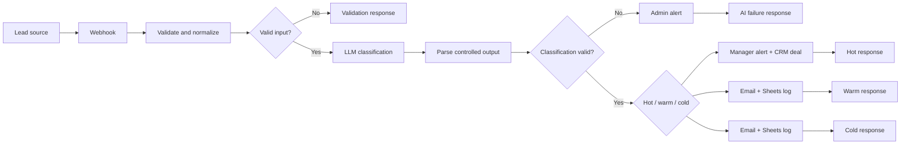
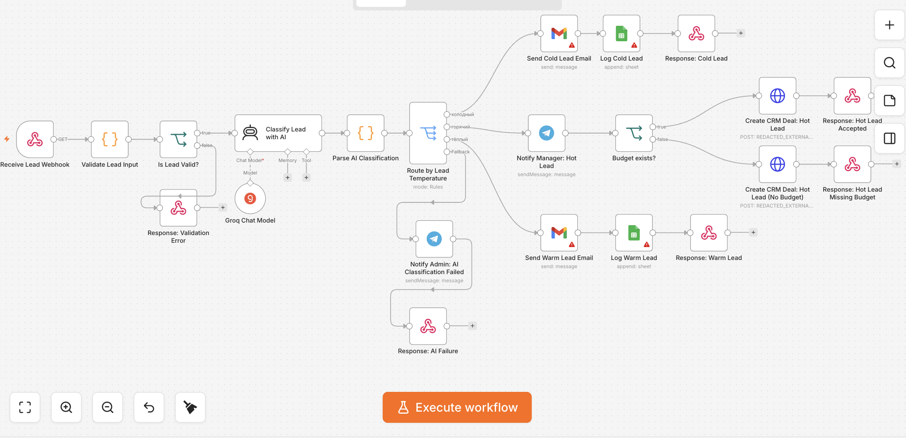

# AI Lead Processing Pipeline

A webhook-driven n8n pipeline that validates inbound leads, classifies intent with an LLM, routes by lead temperature, and triggers channel-specific follow-up.

[Workflow export](./workflows/ai-lead-processing-pipeline.json) · [Sample input](./examples/sample-input.json) · [Sample output](./examples/sample-output.json) · [Test scenarios](./tests/TEST_CASES.md)

> Scope: portfolio demonstration. The workflow shows explicit validation, AI-output parsing, deterministic routing, and separate webhook responses; it is not a complete CRM transaction layer.

## Business problem

Sales teams receive leads with different levels of intent and incomplete data. Manual triage delays hot opportunities, while sending every contact through the same sequence wastes manager time and creates an inconsistent customer experience.

The integration needs to reject malformed input, distinguish hot, warm, and cold leads, and make each downstream action visible and auditable.

## Solution

An n8n webhook receives lead data through query parameters. A Code node validates the required fields and normalizes the budget before an AI Agent classifies the lead. A second Code node parses the model response into a controlled structure.

A deterministic Switch routes the result. Hot leads notify a manager and create a CRM deal; warm leads receive an email and are logged; cold leads receive a different email and are logged. Every route returns its own HTTP response, including validation and AI-failure paths.

## Architecture


```mermaid
flowchart LR
    Client[Lead source] --> Hook[Webhook]
    Hook --> Validate[Validate and normalize]
    Validate --> Valid{Valid input?}
    Valid -->|No| R400[Validation response]
    Valid -->|Yes| Agent[LLM classification]
    Agent --> Parse[Parse controlled output]
    Parse --> Parsed{Classification valid?}
    Parsed -->|No| Alert[Admin alert]
    Alert --> RAI[AI failure response]
    Parsed -->|Yes| Route{Hot / warm / cold}
    Route --> Hot[Manager alert + CRM deal]
    Route --> Warm[Email + Sheets log]
    Route --> Cold[Email + Sheets log]
    Hot --> RH[Hot response]
    Warm --> RW[Warm response]
    Cold --> RC[Cold response]
```

## Workflow screenshots / Output evidence



| Evidence | Preview |
| --- | --- |
| Hot-lead response | [Open image](./screenshots/hot-lead-response.png) |
| Validation error | [Open image](./screenshots/validation-error-response.png) |
| AI failure | [Open image](./screenshots/ai-failure-response.png) |

Synthetic contract examples: [`sample-input.json`](./examples/sample-input.json) and [`sample-output.json`](./examples/sample-output.json).

## Key engineering decisions

- Input validation runs before the paid and probabilistic AI step.
- AI performs semantic lead assessment; a Switch node owns deterministic routing.
- The model result is parsed in code rather than passed directly to CRM, email, or Sheets nodes.
- Hot leads have a separate budget branch, so missing budget is visible in both behavior and response.
- Each terminal branch responds explicitly to the original webhook request.

## Input and output contract

**Trigger:** HTTP webhook using query parameters.

**Required input:** `name`, `email`, `phone`, `request`, and `secret`. Budget is parsed when present and affects the hot-lead route.

**Controlled AI output:** lead `temperature`, classification `reason`, and recommended `next_action`.

**Business outputs:** CRM request for hot leads, Telegram manager alert, Gmail follow-up, Google Sheets log for warm or cold leads, and a route-specific HTTP response.

## Failure handling

- An invalid shared secret is rejected before processing.
- Missing or malformed lead fields return a validation response instead of reaching the model.
- Invalid AI output triggers an administrator notification and a dedicated failure response.
- Integration errors remain visible in n8n execution history.
- The current workflow has no compensating action if one side effect succeeds and a later one fails.

## Repository structure

```text
02-lead-funnel/
├── README.md
├── workflows/ai-lead-processing-pipeline.json
├── screenshots/
├── examples/
└── tests/TEST_CASES.md
```

## Setup

1. Import [`ai-lead-processing-pipeline.json`](./workflows/ai-lead-processing-pipeline.json).
2. Configure Groq, Telegram, Gmail, Google Sheets, and CRM HTTP credentials in n8n.
3. Replace `YOUR_API_SECRET`, `YOUR_CRM_ENDPOINT`, `YOUR_TELEGRAM_CHAT_ID`, and `YOUR_GOOGLE_SHEET_ID`.
4. Select the warm/cold target sheets, confirm the public webhook response mode, and map CRM and sheet fields.
5. Run the documented manual tests before activating the workflow.

## Test scenarios

The scenario set covers invalid authentication, missing fields, all three lead temperatures, hot leads with and without budget, malformed AI output, and downstream integration failures. See [`tests/TEST_CASES.md`](./tests/TEST_CASES.md).

## Known limitations

- The shared secret arrives as a query parameter and should be replaced by stronger authentication in production.
- Classification is probabilistic and has no evaluation dataset or monitored quality threshold.
- The pipeline has no idempotency key, duplicate protection, or transactional outbox.
- CRM, email, Sheets, and Telegram side effects are not atomic.
- Personal-data retention and deletion policies are outside this demonstration.

## Production hardening path

- accept a versioned JSON body and authenticate with signed requests or an API gateway;
- validate the model response against a strict schema and add classification evals;
- introduce an idempotency key and unique persistence constraint;
- decouple delivery through a queue or transactional outbox with retries;
- redact personal data in logs and define retention controls;
- add centralized error handling, metrics, and operator alerts.

## Tech stack

`n8n` · `Groq` · `Webhook API` · `Telegram Bot API` · `Gmail` · `Google Sheets` · `CRM REST API`

---

## Русская версия

Проект принимает лид через webhook, проверяет входные данные, использует LLM для смысловой классификации и затем детерминированно разводит результат по веткам «горячий», «тёплый» и «холодный». Действия отличаются: уведомление менеджера и CRM для горячего лида, письма и журналирование для остальных.

Инженерная ценность здесь не в одном AI Agent, а в границах вокруг него: ранняя валидация, отдельный парсер ответа модели, явные ветки ошибок и контролируемые HTTP-ответы. Для production нужны идемпотентность, более сильная аутентификация и надёжная доставка побочных эффектов.
