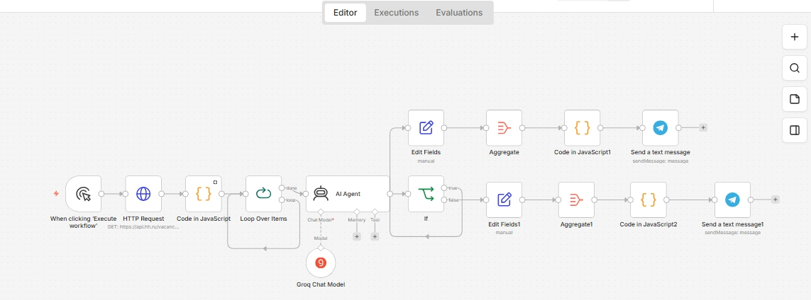

# 🔍 Умный парсер вакансий с LLM-скорингом

[🇷🇺 По-русски](#-по-русски) · [🇬🇧 In English](#-in-english)



---

## 🇷🇺 По-русски

### Контекст

Поиск работы через ленту HH.ru быстро превращается в ручную фильтрацию десятков постов в день: открыть, пробежать глазами, закрыть, повторить. Фильтры самого HH дают слишком широкую выборку — по тегу «automation engineer» всё равно приходит много нерелевантных позиций, где стек пересекается только на 20%. Нужен инструмент, который оставляет вакансии, подходящие и по содержанию, и по формальным требованиям.

### Система

```
Manual Trigger
   ↓
HTTP Request → GET api.hh.ru/vacancies
   ↓
Code in JavaScript (нормализация полей)
   ↓
Loop Over Items
   ↓
AI Agent (Groq) — оценка по промпту под навыки
   ↓
      IF (зарплата ≥ 100k AND формат = удалёнка)
     ↙ ↘
  true   false
   ↓      ↓
Edit Fields    Edit Fields1
   ↓             ↓
Aggregate    Aggregate1
   ↓             ↓
Code         Code1
   ↓             ↓
Telegram (подходящие)    Telegram (остальные)
```

1. **Manual Trigger** — запуск вручную, когда нужно свежий дайджест.
2. **HTTP Request** — GET к `api.hh.ru/vacancies` с параметрами поиска (ключевые слова, регион, опыт).
3. **Code in JavaScript** — нормализация ответа HH.ru: извлечение зарплаты (она приходит в разных форматах: `from`/`to`, валюта, «не указана»), формата работы, описания.
4. **Loop Over Items** — перебор вакансий по одной, чтобы LLM работала с каждой отдельно (а не пыталась разобрать массив из 50 объектов).
5. **AI Agent на Groq** — фиксированный промпт с критериями под конкретные навыки. Читает название и описание, возвращает решение.
6. **IF** — жёсткие критерии: зарплата ≥ 100k AND формат = «Удаленная работа».
7. **Две параллельные ветки** — подходящие и остальные. Каждая проходит через Edit Fields (подготовка текста), Aggregate (сборка в один список), Code (форматирование) и улетает в Telegram двумя сообщениями.

### Что интересно

**Чистое разделение ответственности между LLM и детерминированной логикой.**
- Groq отвечает за содержательную оценку — соответствуют ли описанные требования моим навыкам, какой общий уклон вакансии, стоит ли вообще рассматривать.
- IF отвечает за объективные числовые критерии — зарплата и формат работы.

LLM **не занимается тем, в чём она слабее всего** — сравнением чисел и точным равенством. Этот split — одно из самых полезных архитектурных решений, которые я сделала в портфолио. Если всё отдать LLM, она периодически будет пропускать вакансии с зарплатой 95k «потому что почти подходит», а детерминированная логика этого не допустит.

**Две ветки вместо одной.** «Остальные» вакансии не теряются — они тоже уходят в Telegram, отдельным сообщением. Так я могу проверить, не отсекает ли фильтр что-то важное (например, вакансию с недоуказанной зарплатой, которая по содержанию идеальна).

**Реальное использование.** Этим парсером я сама отсматривала вакансии при поиске работы и на его выдаче определила лучший fit для себя. Это тот редкий случай, когда учебный проект прошёл проверку настоящей задачей.

### Стек

- `n8n` — оркестратор
- `Groq` — LLM для оценки
- `HH.ru API` — источник данных
- `Telegram Bot API` — канал доставки дайджеста
- JavaScript — нормализация и форматирование

### Credentials, которые нужно настроить

- Groq API key
- Telegram Bot с `chat_id` получателя дайджеста
- HH.ru API — ключ не нужен для публичного поиска вакансий

### Как запустить

1. `Workflows → Import from File` → [`workflow.json`](./workflow.json).
2. Настроить Groq и Telegram credentials.
3. В HTTP Request: поменять параметры запроса под свои критерии (ключевые слова, регион, опыт).
4. В AI Agent: переписать промпт под свой стек (сейчас там промпт под мои навыки).
5. В IF: поменять пороги — зарплату и формат.
6. Execute Workflow → получить два сообщения в Telegram.

---

## 🇬🇧 In English

### Context

Job hunting through the HH.ru feed quickly turns into manually filtering dozens of postings a day: open, skim, close, repeat. HH's own filters cast too wide a net — even the "automation engineer" tag returns plenty of positions where the stack overlap is maybe 20%. You need a tool that keeps only vacancies matching both the content and the hard requirements.

### System

```
Manual Trigger
   ↓
HTTP Request → GET api.hh.ru/vacancies
   ↓
Code in JavaScript (field normalisation)
   ↓
Loop Over Items
   ↓
AI Agent (Groq) — skills-matched prompt
   ↓
      IF (salary ≥ 100k AND format = remote)
     ↙ ↘
  true   false
   ↓      ↓
Edit Fields    Edit Fields1
   ↓             ↓
Aggregate    Aggregate1
   ↓             ↓
Code         Code1
   ↓             ↓
Telegram (matches)    Telegram (rest)
```

1. **Manual Trigger** — run on demand when a fresh digest is needed.
2. **HTTP Request** — GET to `api.hh.ru/vacancies` with search parameters (keywords, region, experience).
3. **Code in JavaScript** — normalises the HH.ru response: extracts salary (which arrives in multiple formats: `from`/`to`, currency, "not specified"), work format, description.
4. **Loop Over Items** — iterate one vacancy at a time so the LLM works on each individually (not on a 50-object array).
5. **AI Agent on Groq** — a fixed prompt with skill criteria. Reads the title and description, returns a decision.
6. **IF** — hard criteria: salary ≥ 100k AND format = "remote".
7. **Two parallel branches** — matches and the rest. Each goes through Edit Fields (text prep), Aggregate (assemble into one list), Code (formatting), and out to Telegram as two separate messages.

### What's interesting

**A clean split of responsibilities between the LLM and deterministic logic.**
- Groq handles substantive assessment — do the stated requirements match my skills, what's the overall slant of the role, is it worth considering at all.
- The IF handles objective numeric criteria — salary and work format.

The LLM **doesn't do what it's weakest at** — comparing numbers and exact equality. This split is one of the most useful architectural choices in this portfolio. Hand everything to an LLM and it will sometimes let a 95k salary through "because it's almost there"; deterministic logic won't.

**Two branches, not one.** "The rest" aren't dropped — they also go to Telegram as a separate message. That way I can check whether the filter is cutting off something important (e.g. a vacancy with an unstated salary that's ideal content-wise).

**Real usage.** I used this parser myself during my own job search and picked my best-fit role from its output. A rare case where a study project passed the test of a real task.

### Stack

- `n8n` — orchestrator
- `Groq` — evaluation LLM
- `HH.ru API` — data source
- `Telegram Bot API` — digest delivery channel
- JavaScript — normalisation and formatting

### Credentials to configure

- Groq API key
- Telegram Bot with the recipient `chat_id`
- HH.ru API — no key needed for public vacancy search

### How to run

1. `Workflows → Import from File` → [`workflow.json`](./workflow.json).
2. Configure Groq and Telegram credentials.
3. In the HTTP Request: change the query parameters to your criteria (keywords, region, experience).
4. In the AI Agent: rewrite the prompt for your stack (it's currently tuned to my skills).
5. In the IF: change the thresholds — salary and format.
6. Execute Workflow → receive two Telegram messages.
