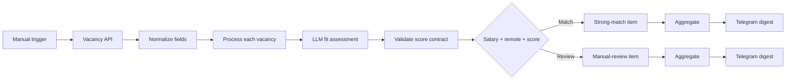
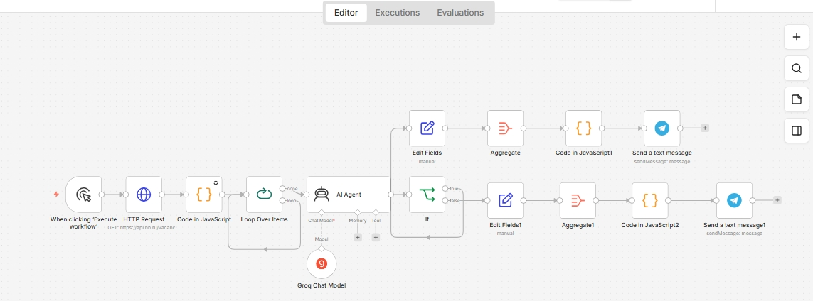

# Smart Vacancy Parser with LLM Scoring

An n8n workflow that retrieves vacancies, normalizes job data, scores semantic fit with an LLM, and delivers separate Telegram digests for strong matches and manual review.

[Workflow export](./workflows/smart-vacancy-parser.json) · [Normalized vacancy](./examples/normalized-vacancy.json) · [AI score contract](./examples/score-output.json) · [Test scenarios](./tests/TEST_CASES.md)

> Scope: manually triggered portfolio workflow. It demonstrates normalization and guarded use of AI scoring, not a continuous job-search crawler.

## Business problem

Keyword-only job alerts generate noisy results. Titles vary, responsibilities are phrased differently, and a role can be relevant even when it does not contain every expected term.

A useful shortlist needs both deterministic filters—such as salary and work format—and a semantic assessment that remains inspectable rather than silently deciding on behalf of the user.

## Solution

The workflow calls the HeadHunter API, normalizes vacancy fields in JavaScript, and processes items in a loop. An AI Agent returns strict JSON with a numeric score, verdict, strengths, risks, and summary. A dedicated parser validates that contract and falls back to manual review when output is invalid.

The final IF combines three conditions: minimum salary, remote work format, and AI score. Strong matches and review candidates are aggregated into separate Telegram digests.

## Architecture


```mermaid
flowchart LR
    Manual[Manual trigger] --> API[Vacancy API]
    API --> Normalize[Normalize fields]
    Normalize --> Loop[Process each vacancy]
    Loop --> Agent[LLM fit assessment]
    Agent --> Parse[Validate score contract]
    Parse --> Gate{Salary + remote + score}
    Gate -->|Match| Strong[Strong-match item]
    Gate -->|Review| Review[Manual-review item]
    Strong --> A1[Aggregate]
    Review --> A2[Aggregate]
    A1 --> T1[Telegram digest]
    A2 --> T2[Telegram digest]
```

## Workflow screenshots / Output evidence



Synthetic outputs: [`normalized-vacancy.json`](./examples/normalized-vacancy.json) and [`score-output.json`](./examples/score-output.json).

## Key engineering decisions

- API payloads are normalized before entering prompts or route conditions.
- The model must return a bounded `0–100` score plus evidence-oriented fields.
- A Code node parses and validates the AI response before the score affects routing.
- Invalid model output becomes a visible manual-review result with score `0`.
- Final acceptance combines deterministic constraints with semantic scoring; AI is not the only gate.
- Separate digests keep strong matches distinct from uncertain or rejected items.

## Input and output contract

**Trigger:** manual n8n execution.

**Source input:** HeadHunter API vacancy records requested with `text=n8n автоматизация`, `area=113`, `per_page=10`, `salary=100000`, and `only_with_salary=true` in the public export. These are reviewable configuration values, not universal defaults.

**Normalized fields:** title, company, salary, currency, work format, requirements, responsibilities, and URL.

**AI output:** `score`, `verdict`, `strengths`, `risks`, and `summary` as strict JSON.

**Business output:** one Telegram digest for strong matches and one digest for vacancies requiring review.

## Failure handling

- Missing source fields receive safe normalized defaults.
- Invalid JSON, a non-numeric score, or a score outside `0–100` is converted to a manual-review result.
- Empty aggregates produce an explicit no-results message instead of malformed Telegram content.
- API, model, and Telegram transport errors remain visible in n8n execution history.
- There is no checkpoint that resumes a partially processed API page after failure.

## Repository structure

```text
03-hh-parser/
├── README.md
├── workflows/smart-vacancy-parser.json
├── screenshots/workflow-overview.jpg
├── examples/
└── tests/TEST_CASES.md
```

## Setup

1. Import [`smart-vacancy-parser.json`](./workflows/smart-vacancy-parser.json).
2. Configure Groq and Telegram credentials in n8n.
3. Replace `YOUR_TELEGRAM_CHAT_ID` and review the HeadHunter API query parameters.
4. Adjust the minimum salary, remote-work value, and AI-score threshold to the target role.
5. Run the test scenarios with synthetic fixtures before processing live vacancy data.

## Test scenarios

The manual checks cover a strong match, low salary, non-remote work, low semantic score, malformed AI JSON, missing vacancy fields, an empty API result, and integration failures. See [`tests/TEST_CASES.md`](./tests/TEST_CASES.md).

## Known limitations

- Execution is manual and processes only the configured API response; pagination is not implemented.
- API rate limits and `429` responses have no dedicated backoff policy.
- There is no durable checkpoint, vacancy deduplication, or history of score changes.
- Fit scores depend on the prompt and model and have no labeled evaluation set.
- Salary filtering does not fully normalize every currency or salary-range edge case.
- Telegram is the only presentation layer.

## Production hardening path

- add scheduled execution, pagination, rate-limit handling, and durable checkpoints;
- persist vacancy IDs and prevent duplicate notifications;
- normalize currencies and salary ranges explicitly;
- version the scoring rubric and evaluate it against labeled examples;
- add retry policies, centralized error handling, and observability;
- expose review decisions so they can improve future scoring.

## Tech stack

`n8n` · `HeadHunter API` · `Groq` · `JavaScript` · `Telegram Bot API`

---

## Русская версия

Workflow получает вакансии, приводит разнородные поля к единому контракту и запрашивает у LLM структурированную оценку соответствия. Итоговый маршрут зависит не только от модели: одновременно проверяются зарплата, удалённый формат и порог AI-score.

Ответ модели теперь действительно используется и валидируется. Если JSON повреждён или score некорректен, вакансия не теряется и не проходит как подходящая — она попадает в ручную проверку. Для production остаются пагинация, дедупликация, чекпоинты и измеримая оценка качества модели.
