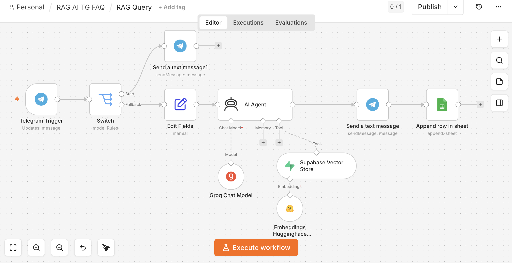
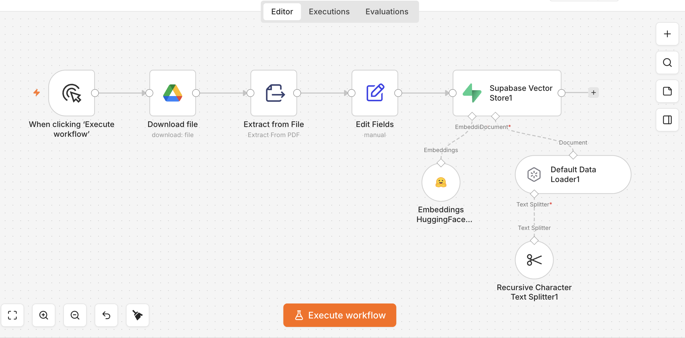

# 🤖 RAG Telegram FAQ Bot

[🇷🇺 По-русски](#-по-русски) · [🇬🇧 In English](#-in-english)





---

## 🇷🇺 По-русски

### Описание проекта

Этот проект — AI FAQ-бот на базе RAG (Retrieval-Augmented Generation), собранный в n8n.

Бот принимает вопросы пользователей в Telegram, ищет релевантную информацию в базе знаний, хранящейся в Supabase Vector Store, генерирует ответ с помощью LLM Groq и отправляет его обратно пользователю.

Дополнительно система:

- показывает приветственное сообщение по команде `/start`;
- логирует все вопросы и ответы в Google Sheets;
- использует PDF-документы как источник знаний.

---

## Бизнес-задача

Компаниям часто нужен простой способ превратить инструкции, FAQ и документацию в чат-бота поддержки.

Этот проект решает задачу:

- автоматической поддержки клиентов;
- поиска по внутренней базе знаний;
- сокращения нагрузки на сотрудников;
- анализа пользовательских запросов.

---

## Архитектура решения

### Ingest Workflow

```text
Google Drive PDF
→ Extract From File
→ Text Splitter
→ Embeddings (Hugging Face)
→ Supabase Vector Store
```

### Query Workflow

```text
Telegram Trigger
→ Switch (/start)
├── Start → Welcome Message
└── Question Flow:
    → Edit Fields
    → AI Agent
    → Supabase Vector Store Tool
    → Groq Chat Model
    → Send Message to Telegram
    → Google Sheets Logging
```

---

## Что делает система

### RAG Ingest

Workflow загружает PDF-файл из Google Drive, извлекает текст, разбивает его на чанки, создает embeddings и сохраняет их в Supabase.

### RAG Query

Workflow принимает вопрос пользователя в Telegram, ищет подходящие фрагменты в векторной базе, передает их в AI Agent и отправляет готовый ответ.

### Логирование

Каждый вопрос и ответ автоматически сохраняются в Google Sheets:

- дата;
- user ID;
- имя пользователя;
- вопрос;
- ответ.

---

## Стек технологий

- n8n
- Telegram Bot API
- AI Agent
- Groq (`llama-3.3-70b-versatile`)
- Hugging Face Embeddings
- Supabase Vector Store
- Google Drive
- Google Sheets
- PDF parsing
- RAG architecture

---

## Credentials

Для запуска необходимо настроить:

- Telegram Bot Token
- Groq API Key
- Hugging Face API Key
- Supabase URL + Service Role Key
- Google Drive OAuth2
- Google Sheets OAuth2

---

## Как запустить

1. Импортировать:
   - `RAG Ingest.json`
   - `RAG Query.json`
2. Настроить credentials.
3. Указать свой PDF-файл в Google Drive.
4. Выполнить `RAG Ingest`.
5. Запустить `RAG Query`.
6. Активировать workflow.
7. Написать боту в Telegram.

---

## Пример вопросов

- Почему утюг прилипает к одежде?
- Как избежать царапин на подошве утюга?
- Как очистить утюг от накипи?

---

## Безопасность

Из публичной версии проекта удалены:

- API keys;
- OAuth tokens;
- webhook URLs;
- file IDs;
- credentials.

---

## Возможные улучшения

- поддержка нескольких документов;
- загрузка файлов прямо через Telegram;
- оценка качества ответов;
- feedback-кнопки 👍 / 👎;
- хранение логов в Supabase;
- веб-интерфейс для администрирования.


---

## 🇬🇧 In English

### Project Description

This project is a Telegram AI FAQ bot built with RAG (Retrieval-Augmented Generation) using n8n.

The bot receives questions in Telegram, retrieves relevant chunks from a knowledge base stored in Supabase Vector Store, generates an answer with Groq, and sends it back to the user.

Additional features:

- `/start` welcome message;
- Google Sheets logging;
- PDF-based knowledge ingestion.

---

## Business Problem

Companies often need a quick way to turn manuals, documentation, and FAQs into an AI-powered support assistant.

This solution helps:

- automate customer support;
- search internal knowledge bases;
- reduce manual workload;
- analyze customer questions.

---

## Architecture

### Ingest Workflow

```text
Google Drive PDF
→ Extract From File
→ Text Splitter
→ Embeddings
→ Supabase Vector Store
```

### Query Workflow

```text
Telegram Trigger
→ Switch (/start)
├── Welcome Message
└── Question Flow
    → Edit Fields
    → AI Agent
    → Supabase Vector Store Tool
    → Groq Chat Model
    → Telegram Response
    → Google Sheets Logging
```

---

## Tech Stack

- n8n
- Telegram Bot API
- AI Agent
- Groq (`llama-3.3-70b-versatile`)
- Hugging Face Embeddings
- Supabase Vector Store
- Google Drive
- Google Sheets
- RAG

---

## How to Run

1. Import:
   - `RAG Ingest.json`
   - `RAG Query.json`
2. Configure credentials.
3. Select your PDF file in Google Drive.
4. Run `RAG Ingest`.
5. Activate `RAG Query`.
6. Message the Telegram bot.

---

## Security

The public version does not contain:

- API keys;
- tokens;
- credentials;
- personal data.
