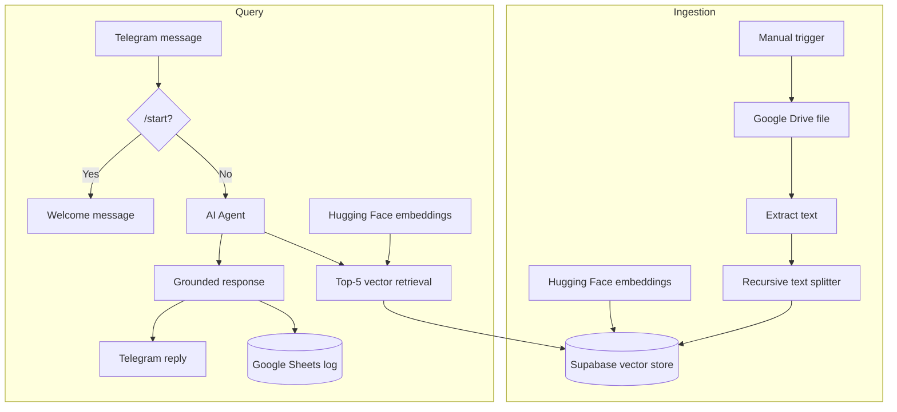
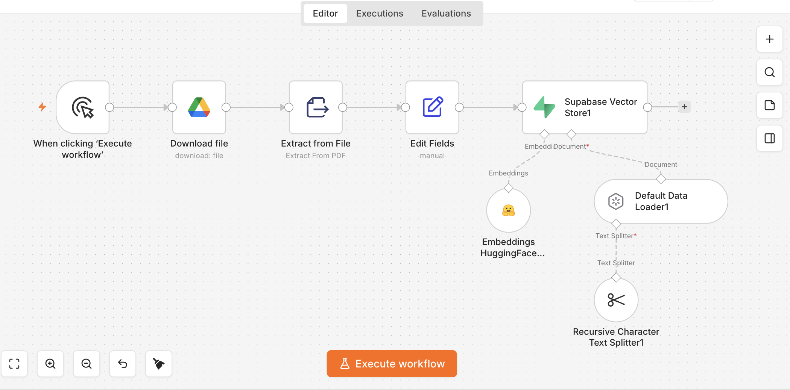
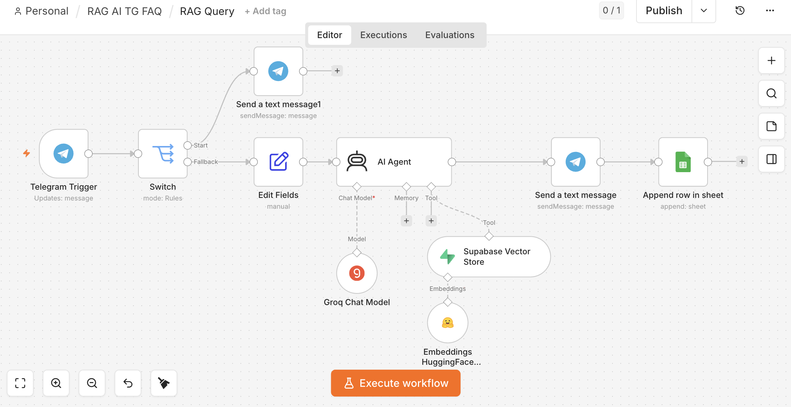

# RAG Telegram FAQ Bot

A two-workflow retrieval-augmented generation system that ingests a document into Supabase and answers Telegram questions from retrieved knowledge rather than unrestricted model memory.

[Ingestion workflow](./workflows/rag-ingest.json) · [Query workflow](./workflows/rag-query.json) · [Synthetic evidence](./examples/grounded-answer.json) · [Test scenarios](./tests/TEST_CASES.md)

> Scope: portfolio RAG reference implementation. The current query path instructs the agent to use retrieval, but it does not expose citations or enforce a numeric relevance threshold.

## Business problem

Support teams repeatedly answer questions that are already covered in manuals or internal instructions. A generic chatbot can sound convincing while inventing unsupported details, and a simple keyword search may miss semantically related wording.

The system needs a controlled knowledge-ingestion path and a user-facing query path with an explicit no-context response.

## Solution

The ingestion workflow downloads a configured Google Drive PDF, extracts its text, splits it into 400-character chunks with 50-character overlap, generates Hugging Face embeddings, and inserts the resulting documents into a Supabase vector table.

The query workflow receives Telegram messages. `/start` follows a deterministic welcome branch; other questions are sent to an AI Agent with the Supabase vector store registered as a retrieval tool. The prompt requires retrieval for every question and defines a fixed fallback when the knowledge base has no answer. Questions and responses are also appended to Google Sheets.

## Architecture


```mermaid
flowchart TB
    subgraph Ingestion
        Manual[Manual trigger] --> Drive[Google Drive file]
        Drive --> Extract[Extract text]
        Extract --> Split[Recursive text splitter]
        Embed1[Hugging Face embeddings] --> Store[(Supabase vector store)]
        Split --> Store
    end

    subgraph Query
        Telegram[Telegram message] --> Route{/start?}
        Route -->|Yes| Welcome[Welcome message]
        Route -->|No| Agent[AI Agent]
        Agent --> Retrieve[Top-5 vector retrieval]
        Embed2[Hugging Face embeddings] --> Retrieve
        Retrieve --> Store
        Agent --> Answer[Grounded response]
        Answer --> TelegramReply[Telegram reply]
        Answer --> Log[(Google Sheets log)]
    end
```

## Workflow screenshots / Output evidence

**Ingestion workflow**



**Telegram query workflow**



Synthetic question, context, and answer contracts are available in [`examples/`](./examples/).

## Key engineering decisions

- Ingestion and online querying are separate workflows with different failure and scaling profiles.
- Chunking and embedding happen before storage; the query workflow retrieves only the top five matches.
- The vector store is exposed to the agent as a required tool, not pasted into every prompt manually.
- `/start` is routed deterministically without spending model tokens.
- A fixed no-information message limits unsupported answers at the prompt level.
- Public exports contain resource placeholders and no credential mappings.

## Input and output contract

**Ingestion input:** a Google Drive file identified by `YOUR_GOOGLE_DRIVE_FILE_ID`.

**Stored output:** document chunks and embeddings in the Supabase `documents` table using the `match_documents` query function.

**Query input:** Telegram text message.

**Query output:** a concise Russian answer based on retrieved context, or `В базе знаний нет информации по этому вопросу.` when the agent determines that context is unavailable. A question/answer log row is appended to Google Sheets.

## Failure handling

- `/start` bypasses retrieval and returns a deterministic onboarding message.
- The system prompt defines an explicit no-context fallback.
- Drive, extraction, embedding, Supabase, model, Sheets, and Telegram failures remain visible in n8n execution history.
- The two workflows have no shared centralized Error Workflow in this demonstration.
- A successful answer followed by a failed log write is not rolled back.

## Repository structure

```text
04-rag-telegram-faq-bot/
├── README.md
├── workflows/
│   ├── rag-ingest.json
│   └── rag-query.json
├── screenshots/
├── examples/
└── tests/TEST_CASES.md
```

## Setup

1. Create a Supabase vector table compatible with the n8n Vector Store node and a `match_documents` function.
2. Import [`rag-ingest.json`](./workflows/rag-ingest.json) and [`rag-query.json`](./workflows/rag-query.json).
3. Configure Google Drive, Hugging Face, Supabase, Groq, Telegram, and Google Sheets credentials in n8n.
4. Replace `YOUR_GOOGLE_DRIVE_FILE_ID`, `YOUR_GOOGLE_SHEET_ID`, and `YOUR_GOOGLE_SHEET_NAME`.
5. Run ingestion once, inspect stored chunks, then execute the query test scenarios before activation.

## Test scenarios

The manual suite covers `/start`, a supported paraphrase, an unsupported question, empty retrieval, duplicate ingestion risk, malformed source content, and failures in each external integration. See [`tests/TEST_CASES.md`](./tests/TEST_CASES.md).

## Known limitations

- Retrieval has no deterministic similarity threshold, so the prompt—not code—decides whether context is relevant enough.
- Answers do not expose source citations, chunk IDs, or retrieval scores.
- Re-running ingestion can create duplicate chunks because source-version deduplication is absent.
- There is no document lifecycle, deletion, tenant isolation, or retention policy.
- Telegram questions and generated answers are logged to Google Sheets without a deployment-specific consent, access, or retention policy.
- Quality is not measured against a question-and-answer evaluation set.

## Production hardening path

- add source IDs, content hashes, versioning, and idempotent upserts;
- enforce a relevance threshold before invoking answer generation;
- return citations and preserve source metadata through retrieval;
- add tenant-aware authorization and document retention controls;
- build retrieval and groundedness evaluations from representative questions;
- add retries, rate-limit handling, tracing, and a centralized error workflow.

## Tech stack

`n8n` · `Supabase / pgvector` · `Hugging Face Inference` · `Groq` · `Google Drive` · `Telegram Bot API` · `Google Sheets`

---

## Русская версия

Проект разделён на два независимых контура. Первый загружает документ, разбивает его на фрагменты, строит embeddings и сохраняет их в Supabase. Второй принимает вопрос из Telegram, извлекает релевантный контекст и формирует ответ с явным правилом «не отвечать из общих знаний».

Это рабочая демонстрация RAG-паттерна, но не полная гарантия groundedness. В текущей версии нет детерминированного порога релевантности, ссылок на источники и защиты от повторной индексации одного документа — эти пункты прямо вынесены в production hardening.
