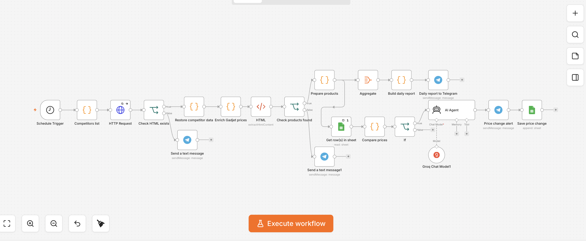
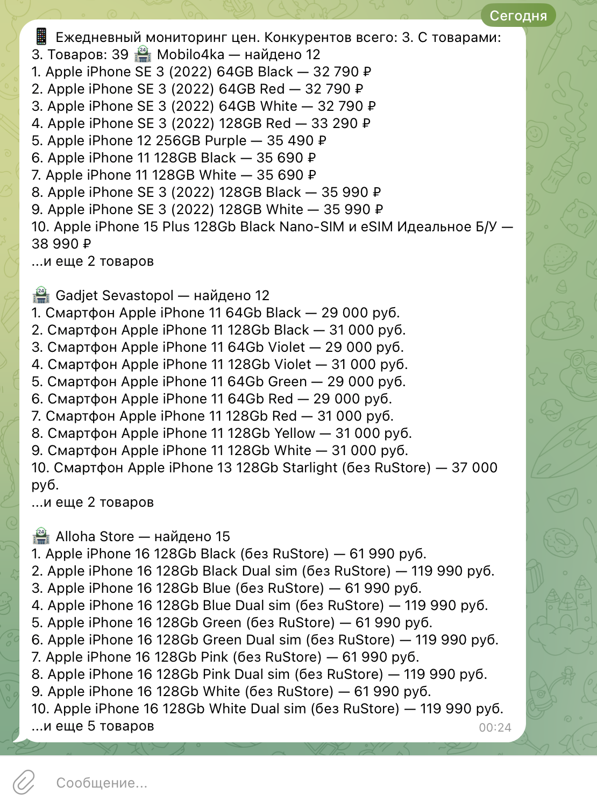
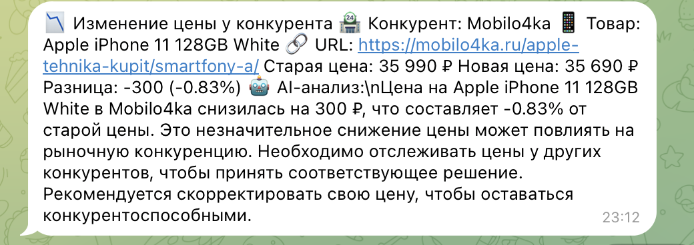
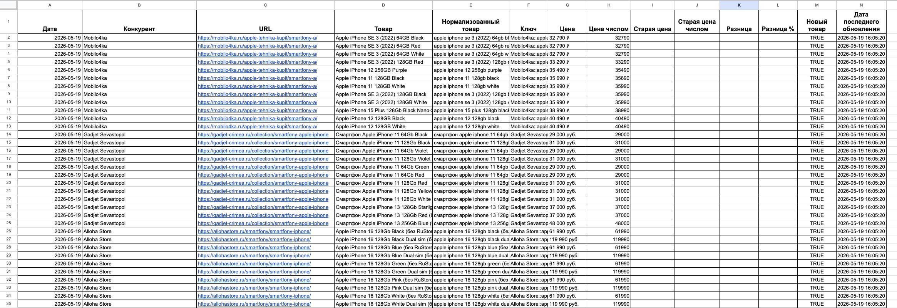

# Competitor Price & Offer Monitoring System

[🇷🇺 По-русски](#-по-русски) · [🇬🇧 In English](#-in-english)



---

## 🇷🇺 По-русски

### Описание проекта

Этот проект — workflow в n8n для мониторинга цен и предложений конкурентов в e-commerce.

Система по расписанию собирает товары с нескольких сайтов, нормализует названия и цены, сравнивает новые значения с историей в Google Sheets, отправляет ежедневный отчёт в Telegram и отдельно уведомляет о реальных изменениях цены с кратким AI-анализом.

Проект сделан как портфельный пример production-oriented автоматизации: с обработкой ошибок, повторными HTTP-запросами, отдельной логикой для сайта со скрытыми ценами и безопасным публичным экспортом без секретов.

---

## Бизнес-задача

Магазину нужно быстро понимать, как меняются цены у конкурентов, не проверяя сайты вручную каждый день.

Workflow помогает:

- видеть ежедневную картину по конкурентам;
- быстро замечать снижение или повышение цены;
- хранить историю изменений;
- получать AI-комментарий по событию;
- не терять сайты, где цены подгружаются отдельно от HTML.

---

## Как работает система

```text
Schedule Trigger
→ Competitors list
→ HTTP Request
→ Check HTML exists
→ Restore competitor data
→ Enrich Gadjet prices
→ HTML Extract
→ Check products found
→ Prepare products

Prepare products
├─ Aggregate
│  → Build daily report
│  → Daily report to Telegram
│
└─ Get row(s) in Google Sheets
   → Compare prices
   → If changed
      → AI Agent
      → Price change alert
      → Save price change
```

### Основные блоки

1. **Competitors list** — список конкурентов, URL и CSS-селекторов.
2. **HTTP Request** — получает HTML страниц с retry и timeout.
3. **Enrich Gadjet prices** — отдельная обработка сайта Gadjet Sevastopol: цены подгружаются через JSON endpoint, поэтому workflow достаёт product ID и получает цены дополнительным запросом.
4. **HTML Extract** — извлекает названия и цены по селекторам.
5. **Prepare products** — нормализует названия, цены и формирует уникальный ключ товара.
6. **Compare prices** — сравнивает текущие цены с историей в Google Sheets.
7. **AI Agent** — объясняет изменение цены коротким текстом.
8. **Telegram** — отправляет ежедневный отчёт и срочные уведомления.
9. **Google Sheets** — хранит историю цен.

---

## Скриншоты

### Workflow в n8n


### Ежедневный отчёт в Telegram



### Уведомление об изменении цены



### История цен в Google Sheets



---

## Что умеет workflow

- мониторит несколько конкурентов одновременно;
- парсит названия и цены товаров;
- поддерживает индивидуальные CSS-селекторы для каждого сайта;
- нормализует названия товаров;
- нормализует цены в числовой формат;
- формирует уникальный ключ товара;
- выявляет новые товары;
- сравнивает текущую цену с последней сохранённой;
- считает разницу в рублях и процентах;
- отправляет ежедневный отчёт в Telegram;
- отправляет отдельный alert при изменении цены;
- добавляет краткий AI-анализ изменения;
- сохраняет историю в Google Sheets;
- обрабатывает ошибки парсинга и HTTP-запросов.

---

## Отслеживаемые конкуренты

| Конкурент | Сайт | Особенность |
|---|---|---|
| Mobilo4ka | https://mobilo4ka.ru | HTML-парсинг карточек |
| Gadjet Sevastopol | https://gadjet-crimea.ru | Цены подгружаются через JSON endpoint |
| Alloha Store | https://allohastore.ru | HTML-парсинг карточек |

---

## Структура Google Sheets

Таблица используется как история цен и источник для сравнения.

| Колонка | Назначение |
|---|---|
| Дата | дата сбора данных |
| Конкурент | название магазина |
| URL | страница-источник |
| Товар | исходное название товара |
| Нормализованный товар | очищенное название для сравнения |
| Ключ | уникальный ключ `competitor + product` |
| Цена | цена как текст |
| Цена числом | цена в числовом формате |
| Старая цена | предыдущая цена |
| Старая цена числом | предыдущая цена в числовом формате |
| Разница | разница в рублях |
| Разница % | процент изменения |
| Новый товар | флаг нового товара |
| Дата последнего обновления | время записи |

---

## Стек

- `n8n`
- `JavaScript` Code nodes
- `Google Sheets`
- `Telegram Bot API`
- `Groq` / AI Agent
- HTML/CSS parsing
- HTTP requests

---

## Как запустить

1. Импортируйте [`workflow.json`](./workflow.json) в n8n.
2. Настройте credentials:
   - Google Sheets OAuth2;
   - Telegram Bot API;
   - Groq API.
3. Замените плейсхолдеры:
   - `GOOGLE_SHEET_ID`;
   - `REPLACE_WITH_TELEGRAM_CHAT_ID`;
   - `REPLACE_WITH_GOOGLE_SHEETS_CREDENTIAL_ID`;
   - `REPLACE_WITH_TELEGRAM_CREDENTIAL_ID`;
   - `REPLACE_WITH_GROQ_CREDENTIAL_ID`.
4. Создайте Google Sheet с колонками из раздела выше.
5. Первый запуск лучше сделать без AI Agent или с ограничением, чтобы заполнить базовые цены без упора в rate limit.
6. После первичного заполнения включите AI-анализ только для реальных изменений цены.
7. Активируйте workflow.

---

## Безопасность

Публичный `workflow.json` очищен от чувствительных данных:

- Telegram `chat_id`;
- Telegram token;
- API keys;
- Google credentials;
- OAuth credentials;
- ngrok URLs;
- email addresses;
- cookie / authorization headers;
- n8n instance ID;
- workflow ID / version ID.

В файле оставлены только публичные URL сайтов конкурентов, потому что они нужны для работы парсинга.

---

## Возможные улучшения

- вынести список конкурентов в Google Sheets или базу данных;
- добавить отдельную таблицу текущих цен и отдельную таблицу истории;
- добавить throttling перед AI Agent;
- добавить Playwright/Browser fallback для сайтов с тяжёлой JavaScript-загрузкой;
- сохранять HTML-снимок при ошибке парсинга;
- добавить графики изменения цен по товарам.

---

## 🇬🇧 In English

### Project Description

This is an n8n workflow for monitoring competitor prices and offers across multiple e-commerce websites.

The system runs on a schedule, collects product data, normalizes product names and prices, compares current values with price history in Google Sheets, sends a daily Telegram report, and creates separate alerts for real price changes with a short AI-generated analysis.

The workflow is designed as a production-oriented portfolio project: it includes error handling, HTTP retries, a special enrichment step for a website with hidden prices, and a sanitized public export without secrets.

---

## Business Problem

An online store needs to understand competitor price changes without checking websites manually every day.

This workflow helps:

- monitor daily competitor prices;
- detect price increases and decreases quickly;
- keep price history;
- receive AI-assisted context for each change;
- handle websites where prices are loaded separately from HTML.

---

## System Architecture

```text
Schedule Trigger
→ Competitors list
→ HTTP Request
→ Check HTML exists
→ Restore competitor data
→ Enrich Gadjet prices
→ HTML Extract
→ Check products found
→ Prepare products

Prepare products
├─ Aggregate
│  → Build daily report
│  → Daily report to Telegram
│
└─ Get row(s) in Google Sheets
   → Compare prices
   → If changed
      → AI Agent
      → Price change alert
      → Save price change
```

### Main Components

1. **Competitors list** — competitor names, URLs, and CSS selectors.
2. **HTTP Request** — fetches page HTML with retry and timeout settings.
3. **Enrich Gadjet prices** — custom handling for Gadjet Sevastopol, where prices are loaded through a JSON endpoint.
4. **HTML Extract** — extracts product names and prices.
5. **Prepare products** — normalizes names, prices, and product keys.
6. **Compare prices** — compares current prices with Google Sheets history.
7. **AI Agent** — explains each price change in a short message.
8. **Telegram** — sends daily reports and instant alerts.
9. **Google Sheets** — stores price history.

---

## Screenshots

### n8n Workflow


### Daily Telegram Report


### Price Change Alert


### Google Sheets Price History


---

## Features

- monitors multiple competitors at the same time;
- parses product names and prices;
- supports custom CSS selectors per website;
- normalizes product names;
- normalizes prices into numeric values;
- generates unique product keys;
- detects new products;
- compares current prices with the latest saved price;
- calculates RUB and percentage differences;
- sends daily Telegram reports;
- sends separate price change alerts;
- adds short AI analysis;
- saves price history to Google Sheets;
- handles parsing and HTTP errors.

---

## Monitored Competitors

| Competitor | Website | Note |
|---|---|---|
| Mobilo4ka | https://mobilo4ka.ru | HTML product card parsing |
| Gadjet Sevastopol | https://gadjet-crimea.ru | Prices loaded through JSON endpoint |
| Alloha Store | https://allohastore.ru | HTML product card parsing |

---

## Google Sheets Structure

The spreadsheet is used as price history and comparison storage.

| Column | Purpose |
|---|---|
| Date | collection date |
| Competitor | store name |
| URL | source page |
| Product Name | raw product name |
| Normalized Product Name | cleaned name for matching |
| Product Key | unique `competitor + product` key |
| Price | raw price text |
| Numeric Price | numeric price |
| Old Price | previous price |
| Old Numeric Price | previous numeric price |
| Difference | difference in RUB |
| Difference % | percentage change |
| New Product | new product flag |
| Last Updated | record timestamp |

---

## Stack

- `n8n`
- `JavaScript` Code nodes
- `Google Sheets`
- `Telegram Bot API`
- `Groq` / AI Agent
- HTML/CSS parsing
- HTTP requests

---

## How to Run

1. Import [`workflow.json`](./workflow.json) into n8n.
2. Configure credentials:
   - Google Sheets OAuth2;
   - Telegram Bot API;
   - Groq API.
3. Replace placeholders:
   - `GOOGLE_SHEET_ID`;
   - `REPLACE_WITH_TELEGRAM_CHAT_ID`;
   - `REPLACE_WITH_GOOGLE_SHEETS_CREDENTIAL_ID`;
   - `REPLACE_WITH_TELEGRAM_CREDENTIAL_ID`;
   - `REPLACE_WITH_GROQ_CREDENTIAL_ID`.
4. Create a Google Sheet with the columns listed above.
5. For the first run, consider disabling AI Agent or limiting it to avoid model rate limits while the baseline is being collected.
6. After the baseline is saved, enable AI analysis only for real price changes.
7. Activate the workflow.

---

## Security

The public `workflow.json` is sanitized and does not contain:

- Telegram `chat_id`;
- Telegram token;
- API keys;
- Google credentials;
- OAuth credentials;
- ngrok URLs;
- email addresses;
- cookie / authorization headers;
- n8n instance ID;
- workflow ID / version ID.

Only public competitor website URLs are kept because they are required for parsing.

---

## Possible Improvements

- move the competitor list to Google Sheets or a database;
- separate current prices from historical price records;
- add throttling before AI Agent;
- add a Playwright/Browser fallback for JavaScript-heavy websites;
- save an HTML snapshot when parsing fails;
- add price trend charts.
