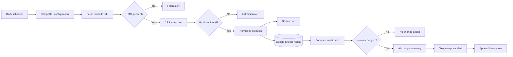
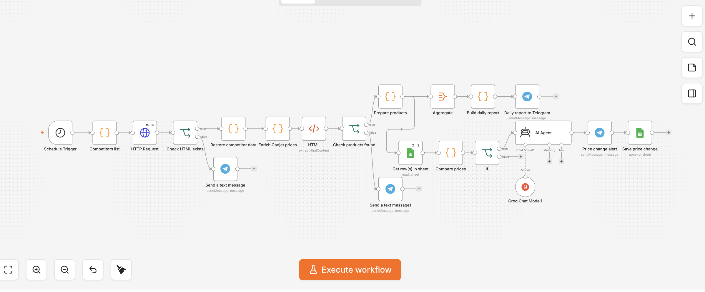

# Competitor Price Monitoring

A scheduled n8n workflow that scrapes public product pages, compares observed prices with history, generates AI-assisted change summaries, and sends Telegram reports.

[Workflow export](./workflows/competitor-price-monitoring.json) · [Sample product](./examples/sample-product.json) · [Price-change contract](./examples/price-change.json) · [Test scenarios](./tests/TEST_CASES.md)

> Scope: portfolio demonstration against configured public pages. Scraping must be reviewed against each source's terms, robots policy, rate limits, and applicable law before real deployment.

## Business problem

Retail teams often monitor competitor prices manually across several pages. This is slow, inconsistent, and makes it difficult to distinguish a real market change from a one-time observation or extraction failure.

A useful automation must preserve price history, report daily coverage, and separate changed products from broken or empty source pages.

## Solution

A daily Schedule Trigger loads a configured competitor list and fetches each public page. Per-source CSS selectors extract product names and prices. JavaScript nodes normalize products, restore source context, and compare the current observation with the latest Google Sheets row.

The workflow builds a daily Telegram report for overall coverage. Changed or newly observed products pass through an AI Agent that summarizes business impact, then trigger a dedicated Telegram alert and a new history row. Missing HTML and empty extraction have explicit alert branches.

## Architecture



## Workflow screenshots / Output evidence



| Evidence | Preview |
| --- | --- |
| Daily coverage report | [Open image](./screenshots/telegram-daily-report.png) |
| Price-change alert | [Open image](./screenshots/telegram-price-alert.png) |
| Google Sheets history | [Open image](./screenshots/google-sheets-price-history.png) |

Synthetic data contracts are available in [`examples/`](./examples/).

## Key engineering decisions

- Source URLs and CSS selectors are configuration data in one Code node.
- Fetch failure and zero extracted products are different error conditions with separate alerts.
- Product keys combine competitor and normalized product identity for history lookup.
- Numeric comparison occurs in JavaScript; AI only explains an already detected change.
- The latest matching Sheets row provides the baseline, and new products are flagged explicitly.
- Daily coverage reporting is independent from individual price-change alerts.

## Input and output contract

**Trigger:** daily schedule at 09:00 in the n8n instance timezone.

**Configured source:** competitor name, public catalog URL, product-name selector, and price selector.

**Normalized observation:** competitor, URL, product name, product key, numeric price, and observation date.

**Business outputs:** one daily Telegram report, an alert for each new or changed product, and a Google Sheets history row for each alerted change.

## Failure handling

- Empty HTTP content triggers a source-fetch alert.
- A successful fetch with no matched products triggers a selector/extraction alert.
- Numeric parsing returns a controlled null instead of silently using invalid arithmetic.
- External node failures remain visible in n8n execution history.
- There is no retry/backoff policy, browser-render fallback, or dead-letter queue in the current export.

## Repository structure

```text
05-competitor-price-monitoring/
├── README.md
├── workflows/competitor-price-monitoring.json
├── screenshots/
├── examples/
└── tests/TEST_CASES.md
```

## Setup

1. Confirm that monitoring each target site is permitted and choose a responsible polling interval.
2. Import [`competitor-price-monitoring.json`](./workflows/competitor-price-monitoring.json).
3. Configure Groq, Telegram, and Google Sheets credentials in n8n.
4. Replace `YOUR_TELEGRAM_CHAT_ID`, `YOUR_GOOGLE_SHEET_ID`, and `YOUR_GOOGLE_SHEET_NAME`.
5. Review every source URL and CSS selector, then test against saved or synthetic HTML before activation.

## Test scenarios

The manual suite covers an unchanged price, increase, decrease, new product, malformed price, missing HTML, selector drift, duplicate history rows, AI failure, and Sheets or Telegram failure. See [`tests/TEST_CASES.md`](./tests/TEST_CASES.md).

## Known limitations

- CSS selectors are brittle and can break when a public page changes.
- JavaScript-rendered or anti-bot-protected pages have no browser fallback.
- Product equivalence relies on name normalization and may confuse variants.
- Google Sheets is not a transactional or concurrency-safe price-history store.
- The AI summary has no deterministic fallback if the model call fails.
- Site terms, robots directives, rate limits, and legal constraints require deployment-specific review.

## Production hardening path

- move source configuration to a controlled table with owner, rate limit, and last-success metadata;
- add polite throttling, retries with backoff, timeouts, and per-source circuit breakers;
- introduce selector fixtures and extraction regression tests;
- use a durable database with unique observation keys and transactional writes;
- add deterministic alert text when AI enrichment is unavailable;
- monitor extraction volume, selector drift, and consecutive source failures.

## Tech stack

`n8n` · `HTTP / HTML extraction` · `JavaScript` · `Groq` · `Google Sheets` · `Telegram Bot API`

---

## Русская версия

Workflow ежедневно получает публичные страницы конкурентов, извлекает товары и цены, сравнивает наблюдение с последней записью в Google Sheets и отправляет отчёты в Telegram. LLM не решает, изменилась ли цена: это определяется кодом; модель лишь формулирует краткий комментарий к уже найденному изменению.

Главные реальные риски — изменение CSS-селекторов, ложное сопоставление товарных вариантов и ограничения сайтов на автоматический сбор данных. Поэтому production-версия требует регрессионных тестов парсинга, аккуратных лимитов запросов, устойчивого хранилища и предварительной правовой проверки источников.
