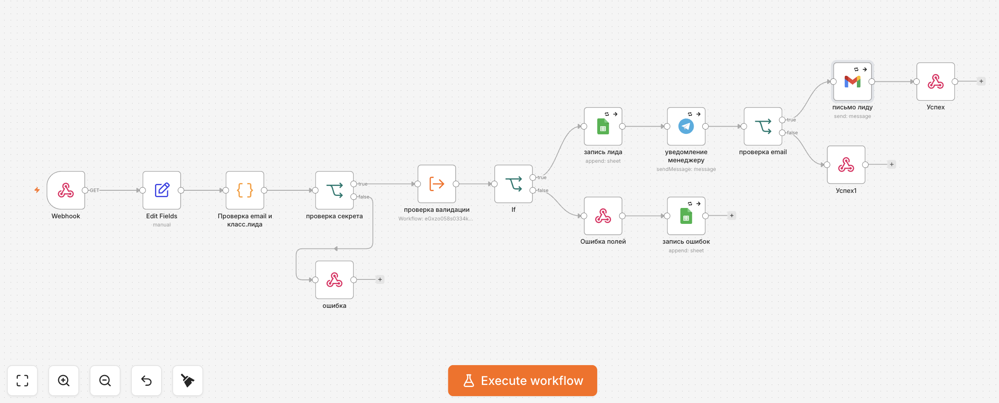
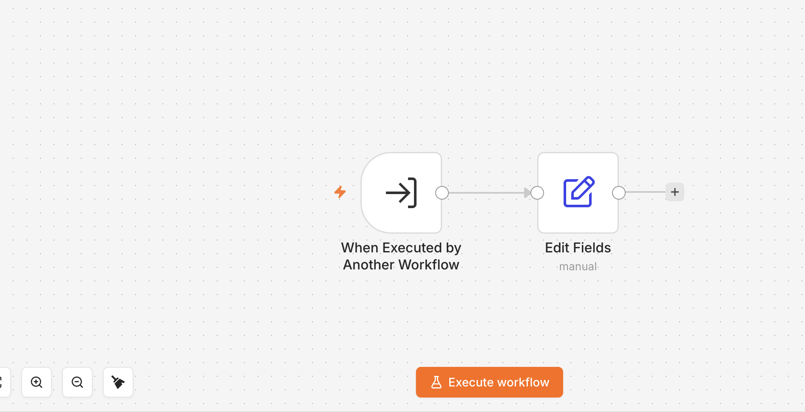

# Fitness Club Trial Workout Funnel



[🇷🇺 По-русски](#-по-русски) · [🇬🇧 In English](#-in-english)

---

## 🇷🇺 По-русски

## Описание

Два связанных workflow на n8n для обработки заявок на пробную тренировку в фитнес-клубе.

Основной workflow принимает заявку через Webhook, проверяет секрет, вызывает sub-workflow для валидации обязательных полей, классифицирует лида по цели, записывает данные в Google Sheets, отправляет уведомление менеджеру в Telegram и, если email валидный, отправляет клиенту письмо через Gmail.

Validation workflow вынесен отдельно, чтобы показать работу с reusable sub-workflow и отделить проверку данных от основной бизнес-логики.

---

## Файлы проекта

- [`main-workflow.json`](./main-workflow.json) - основной workflow обработки заявки.
- [`validation-sub-workflow.json`](./validation-sub-workflow.json) - sub-workflow для проверки обязательных полей.
- [`screenshots/main-workflow.png`](./screenshots/main-workflow.png) - схема основного workflow.
- [`screenshots/validation-sub-workflow.png`](./screenshots/validation-sub-workflow.png) - схема validation workflow.

---

## Скриншоты

### Основной workflow


### Validation sub-workflow



---

## Что делает workflow

- принимает заявку через Webhook query parameters;
- извлекает имя, телефон, email, клуб, цель и секрет запроса;
- проверяет секрет запроса;
- вызывает отдельный validation sub-workflow;
- проверяет обязательные поля: имя, телефон и клуб;
- записывает некорректные заявки в отдельный лист Google Sheets;
- классифицирует лид как `hot`, `warm` или `cold`;
- сохраняет валидные заявки в Google Sheets;
- отправляет уведомление менеджеру в Telegram;
- отправляет email-подтверждение только при наличии валидного email;
- возвращает HTTP-ответ через Respond to Webhook.

---

## Стек

- n8n
- Webhook
- Execute Workflow
- IF
- JavaScript Code node
- Google Sheets
- Telegram
- Gmail

---

## Архитектура

```text
Webhook
→ Edit Fields
→ Проверка email и класс.лида
→ Проверка секрета
→ Validation sub-workflow
→ IF valid
├── invalid request → error response → Google Sheets error log
└── valid request → Google Sheets lead log → Telegram manager notification → email check
    ├── valid email → Gmail confirmation → success response
    └── no valid email → success response
```

Validation sub-workflow:

```text
Execute Workflow Trigger
→ Edit Fields
→ valid + error_reason
```

---

## Пример входящего запроса

Основной workflow ожидает query parameters:

```text
?name=Anna&phone=+79990000000&email=anna@example.com&club=Central&goal=похудение&secret=YOUR_WEBHOOK_SECRET
```

Поля:

- `name` - имя клиента;
- `phone` - телефон клиента;
- `email` - email клиента, необязательное поле;
- `club` - выбранный клуб;
- `goal` - цель тренировки;
- `secret` - простой секрет для проверки запроса.

---

## Логика классификации

Code node классифицирует лидов по полю `goal`:

- `похудение` → `hot`;
- `набор мышечной массы` → `warm`;
- любая другая цель → `cold`.

Этот же узел проверяет, пустой ли email и похож ли он на валидный адрес. Gmail-ветка запускается только для валидного email.

---

## Структура Google Sheets

Лист с лидами:

```text
Дата | Имя | Телефон | email | Клуб | Цель | lead_type
```

Лист с ошибками:

```text
Дата | Имя | Телефон | Клуб | email | Причина ошибки
```

---

## Как запустить

1. Импортируй `validation-sub-workflow.json` в n8n.
2. Скопируй ID импортированного validation workflow.
3. Импортируй `main-workflow.json` в n8n.
4. В узле `проверка валидации` замени `YOUR_SUB_WORKFLOW_ID` на ID validation workflow.
5. В узле `проверка секрета` замени `YOUR_WEBHOOK_SECRET`.
6. В Google Sheets nodes выбери свою таблицу и нужные листы.
7. В Telegram и Gmail nodes подключи свои credentials.
8. В Telegram node замени `YOUR_TELEGRAM_CHAT_ID`.
9. Протестируй Webhook URL и активируй основной workflow.

---

## Безопасность

Публичная версия не содержит:

- credentials;
- реальный Google Sheets document ID;
- Telegram chat ID;
- Gmail credential reference;
- n8n instance metadata;
- internal cached workflow URLs;
- hardcoded private secret.

Перед запуском нужно заменить:

- `YOUR_WEBHOOK_SECRET`;
- `YOUR_SUB_WORKFLOW_ID`;
- `YOUR_GOOGLE_SHEET_ID`;
- `YOUR_TELEGRAM_CHAT_ID`.

---

## 🇬🇧 In English

## Description

Two connected n8n workflows for processing trial workout requests for a fitness club.

The main workflow receives a lead through a Webhook, checks a request secret, calls a validation sub-workflow, classifies the lead by goal, saves the request to Google Sheets, notifies a manager in Telegram, and sends a Gmail confirmation when a valid email is provided.

The validation workflow is separated to demonstrate a reusable sub-workflow and keep data checks apart from the main business logic.

---

## Project Files

- [`main-workflow.json`](./main-workflow.json) - main lead processing workflow.
- [`validation-sub-workflow.json`](./validation-sub-workflow.json) - sub-workflow for required field validation.
- [`screenshots/main-workflow.png`](./screenshots/main-workflow.png) - main workflow diagram.
- [`screenshots/validation-sub-workflow.png`](./screenshots/validation-sub-workflow.png) - validation workflow diagram.

---

## Screenshots

### Main Workflow


### Validation Sub-Workflow


---

## What the Workflow Does

- receives lead data through Webhook query parameters;
- extracts name, phone, email, club, goal, and request secret;
- validates the request secret;
- calls a separate validation sub-workflow;
- checks required fields: name, phone, and club;
- logs invalid requests to a separate Google Sheets tab;
- classifies leads as `hot`, `warm`, or `cold`;
- saves valid leads to Google Sheets;
- sends a Telegram notification to the manager;
- sends a Gmail confirmation only when email is present and valid;
- returns HTTP success or error responses through Respond to Webhook nodes.

---

## Tech Stack

- n8n
- Webhook
- Execute Workflow
- IF
- JavaScript Code node
- Google Sheets
- Telegram
- Gmail

---

## Architecture

```text
Webhook
→ Edit Fields
→ Email check and lead classification
→ Secret check
→ Validation sub-workflow
→ IF valid
├── invalid request → error response → Google Sheets error log
└── valid request → Google Sheets lead log → Telegram manager notification → email check
    ├── valid email → Gmail confirmation → success response
    └── no valid email → success response
```

Validation sub-workflow:

```text
Execute Workflow Trigger
→ Edit Fields
→ valid + error_reason
```

---

## Example Input

The main workflow expects query parameters:

```text
?name=Anna&phone=+79990000000&email=anna@example.com&club=Central&goal=похудение&secret=YOUR_WEBHOOK_SECRET
```

Fields:

- `name` - customer name;
- `phone` - customer phone number;
- `email` - optional customer email;
- `club` - selected club;
- `goal` - customer fitness goal;
- `secret` - simple request secret checked by the workflow.

---

## Lead Classification Logic

The Code node classifies leads by the `goal` field:

- `похудение` → `hot`;
- `набор мышечной массы` → `warm`;
- any other goal → `cold`.

The same node checks whether the email is empty or valid. The Gmail branch runs only when the email is valid.

---

## Google Sheets Structure

Leads sheet:

```text
Дата | Имя | Телефон | email | Клуб | Цель | lead_type
```

Errors sheet:

```text
Дата | Имя | Телефон | Клуб | email | Причина ошибки
```

---

## How to Run

1. Import `validation-sub-workflow.json` into n8n.
2. Copy the imported validation workflow ID.
3. Import `main-workflow.json` into n8n.
4. In the `проверка валидации` node, replace `YOUR_SUB_WORKFLOW_ID` with the validation workflow ID.
5. In the `проверка секрета` node, replace `YOUR_WEBHOOK_SECRET`.
6. In Google Sheets nodes, select your spreadsheet and tabs.
7. In Telegram and Gmail nodes, connect your credentials.
8. In the Telegram node, replace `YOUR_TELEGRAM_CHAT_ID`.
9. Test the Webhook URL and activate the main workflow.

---

## Security

The public workflow version does not include:

- credentials;
- real Google Sheets document ID;
- Telegram chat ID;
- Gmail credential reference;
- n8n instance metadata;
- internal cached workflow URLs;
- hardcoded private secret.

Before running the workflow, replace:

- `YOUR_WEBHOOK_SECRET`;
- `YOUR_SUB_WORKFLOW_ID`;
- `YOUR_GOOGLE_SHEET_ID`;
- `YOUR_TELEGRAM_CHAT_ID`.
