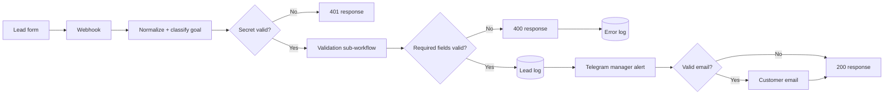
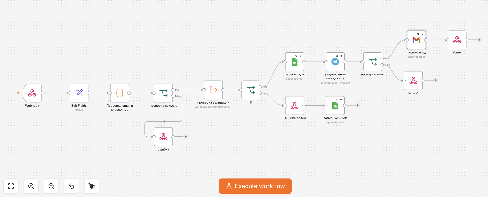
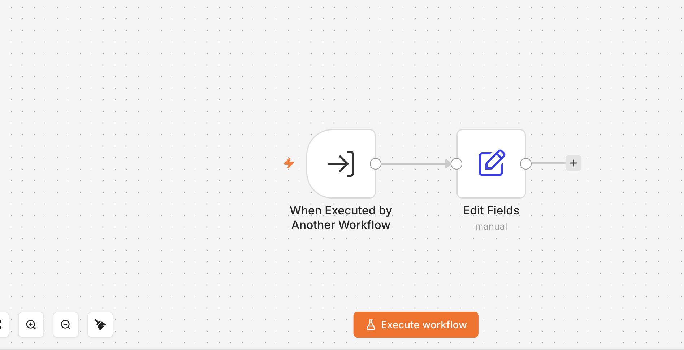

# Fitness Club Lead Capture

A webhook-based n8n integration that authenticates and validates fitness-club leads, classifies a simple business goal deterministically, logs the lead, and coordinates manager and customer notifications.

[Main workflow](./workflows/fitness-club-lead-capture.json) · [Validation sub-workflow](./workflows/validate-fitness-lead.json) · [Sample request](./examples/sample-input.json) · [Test scenarios](./tests/TEST_CASES.md)

> Scope: portfolio demonstration. It shows sub-workflow validation and conditional notification, but does not provide production-grade API authentication or duplicate protection.

## Business problem

Fitness-club campaigns collect leads from forms and landing pages with inconsistent field quality. Managers need immediate, structured notifications, while customers with a valid email should receive confirmation without blocking contacts who prefer phone only.

The integration must reject unauthorized and incomplete requests before writing business data.

## Solution

The main workflow receives query parameters, normalizes the payload, and classifies the stated goal with deterministic JavaScript rules. It verifies a shared secret and calls a separate synchronous validation workflow for the required name, phone, and club fields.

Valid leads are appended to Google Sheets and sent to a manager in Telegram. A confirmation email is sent only when the optional address passes a format check. Invalid required fields receive a `400` response and are written to a separate error log.

## Architecture


```mermaid
flowchart LR
    Form[Lead form] --> Hook[Webhook]
    Hook --> Normalize[Normalize + classify goal]
    Normalize --> Auth{Secret valid?}
    Auth -->|No| R401[401 response]
    Auth -->|Yes| Sub[Validation sub-workflow]
    Sub --> Valid{Required fields valid?}
    Valid -->|No| R400[400 response]
    R400 --> ErrorLog[(Error log)]
    Valid -->|Yes| LeadLog[(Lead log)]
    LeadLog --> Manager[Telegram manager alert]
    Manager --> Email{Valid email?}
    Email -->|Yes| Mail[Customer email]
    Email -->|No| R200[200 response]
    Mail --> R200
```

## Workflow screenshots / Output evidence

**Main workflow**



**Validation sub-workflow**



Synthetic HTTP examples: [`sample-input.json`](./examples/sample-input.json) and [`sample-output.json`](./examples/sample-output.json).

## Key engineering decisions

- Authentication and required-field validation happen before the lead write.
- Required-field rules live in a reusable, synchronous sub-workflow.
- Goal classification is deterministic: weight loss maps to hot, muscle gain to warm, and other values to cold.
- Email is optional; its validity changes the notification path without rejecting an otherwise usable phone lead.
- Invalid requests are both answered and logged for operational review.

## Input and output contract

**Trigger:** HTTP webhook using query parameters.

**Required input:** `name`, `phone`, `club`, and `secret`.

**Optional input:** `email` and `goal`.

**Internal classification:** `hot` for `похудение`, `warm` for `набор мышечной массы`, otherwise `cold`.

**HTTP output:** `401` for an invalid secret, `400` for missing required fields, or `200` with `{"status":"success","message":"application received"}`.

**Business output:** lead or error row in Google Sheets, Telegram manager notification, and optional Gmail confirmation.

## Failure handling

- Invalid authentication returns `401` and stops the business path.
- Missing name, phone, or club returns `400` and produces an error-log row.
- Missing or malformed email skips customer email while preserving the lead.
- Integration failures remain visible in n8n execution history.
- A successful Sheets write is not rolled back if Telegram or Gmail later fails.

## Repository structure

```text
06-fitness-club-lead-capture/
├── README.md
├── workflows/
│   ├── fitness-club-lead-capture.json
│   └── validate-fitness-lead.json
├── screenshots/
├── examples/
└── tests/TEST_CASES.md
```

## Setup

1. Import both workflow exports.
2. Configure Google Sheets, Telegram, and Gmail credentials in n8n.
3. Replace `YOUR_API_SECRET`, `YOUR_FITNESS_VALIDATION_WORKFLOW_ID`, `YOUR_GOOGLE_SHEET_ID`, and `YOUR_TELEGRAM_CHAT_ID`.
4. Select the imported validation workflow in the Execute Workflow node.
5. Create or select the `Leads` and `Errors` sheets and map their columns.
6. Run the manual test scenarios before activation.

## Test scenarios

Coverage includes invalid authentication, each missing required field, an omitted email, malformed email, each goal category, downstream failures, and repeated requests. See [`tests/TEST_CASES.md`](./tests/TEST_CASES.md).

## Known limitations

- The shared secret is supplied in a query parameter.
- Phone is checked only for presence; its format and ownership are not validated.
- Deterministic goal matching recognizes only two exact Russian phrases.
- There is no idempotency key, duplicate check, rate limit, or abuse protection.
- Google Sheets and notification side effects are not transactional.

## Production hardening path

- accept a versioned JSON body behind an API gateway and signed authentication;
- normalize and validate phone numbers with an explicit country policy;
- replace exact goal strings with a controlled taxonomy and mapping table;
- add idempotency storage, unique constraints, and request rate limiting;
- decouple notifications with a queue and retry policy;
- add centralized errors, redacted logs, metrics, and retention rules.

## Tech stack

`n8n` · `Webhook API` · `JavaScript` · `Google Sheets` · `Telegram Bot API` · `Gmail`

---

## Русская версия

Workflow принимает заявку фитнес-клуба, проверяет секрет, вызывает отдельный sub-workflow для обязательных полей и только после этого записывает лид. Менеджер получает Telegram-уведомление, а письмо клиенту отправляется лишь при валидном необязательном email.

Классификация цели здесь намеренно детерминированная, без LLM: для простого справочника это дешевле и предсказуемее. Основные ограничения — отсутствие проверки формата телефона, идемпотентности и транзакционной связи между таблицей и уведомлениями.
