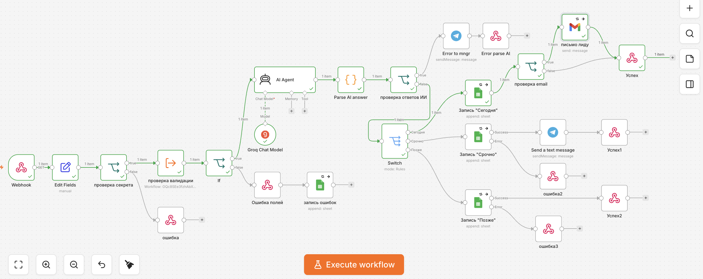
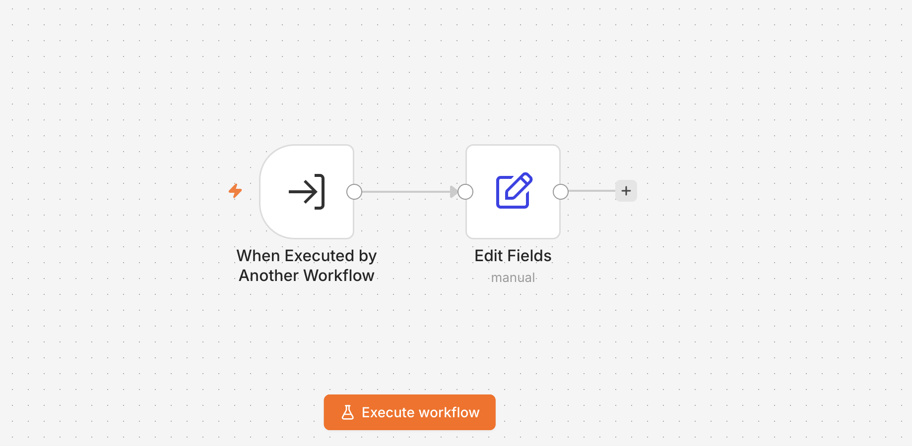

# AI Service Request Automation

**Production-oriented n8n workflow for automated service request processing with AI-powered urgency classification, reusable validation, Google Sheets logging, Gmail confirmations, Telegram notifications, and structured HTTP responses.**

[🇷🇺 По-русски](#-по-русски) · [🇬🇧 In English](#-in-english)

## Screenshots

### Main workflow



### Validation sub-workflow



---

## 🇷🇺 По-русски

## Описание

Два связанных workflow на n8n для автоматизации заявок в сервисный центр по ремонту бытовой техники.

Основной workflow принимает заявку через Webhook, проверяет секрет запроса, вызывает **validation sub-workflow**, классифицирует срочность заявки с помощью LLM, записывает обращение в Google Sheets, уведомляет менеджера в Telegram о срочных заявках и отправляет клиенту email-подтверждение при наличии валидного адреса.

Validation sub-workflow вынесен отдельно, чтобы отделить проверку входных данных от основной бизнес-логики и продемонстрировать использование **переиспользуемого sub-workflow**.

---

## Файлы проекта

- [`main-workflow.json`](./main-workflow.json) - основной workflow.
- [`validation-sub-workflow.json`](./validation-sub-workflow.json) - reusable validation sub-workflow.
- [`screenshots/main-workflow.png`](./screenshots/main-workflow.png) - скриншот основного workflow.
- [`screenshots/validation-sub-workflow.png`](./screenshots/validation-sub-workflow.png) - скриншот validation sub-workflow.

---

## Features

- Webhook API endpoint
- Request secret validation
- Reusable validation sub-workflow
- AI-powered urgency classification
- AI response parsing and validation
- Email validation before sending
- Google Sheets logging
- Telegram notifications
- HTTP responses via Respond to Webhook
- Production-oriented error handling

---

## Что делает workflow

- принимает заявку через **Webhook query parameters**;
- извлекает имя, телефон, email, описание проблемы и секрет;
- проверяет секрет;
- вызывает reusable validation sub-workflow;
- проверяет обязательные поля и формат телефона;
- логирует ошибочные заявки в отдельный лист Google Sheets;
- классифицирует срочность заявки с помощью LLM: `🔴 срочно`, `🟡 сегодня`, `🟢 можно позже`;
- сохраняет валидные заявки в Google Sheets;
- отправляет Telegram-уведомление менеджеру для срочных заявок;
- отправляет email-подтверждение только при валидном email;
- возвращает HTTP-ответ через Respond to Webhook.

> Note: query parameters используются как демонстрационный формат. В production обычно лучше принимать персональные данные через `POST body`.

---

## Стек

- n8n
- Webhook
- Execute Workflow
- AI Agent
- Groq Chat Model
- JavaScript Code node
- IF
- Switch
- Respond to Webhook
- Google Sheets
- Telegram
- Gmail

---

## Архитектура

```text
Webhook
→ Edit Fields
→ Secret check
→ Validation sub-workflow
→ IF valid
├── invalid request → Error response → Google Sheets (Errors)
└── valid request → AI-powered urgency classification
                 → Parse AI answer
                 → IF AI error
                     ├── Telegram manager notification → Error response
                     └── Switch by urgency
                         ├── Today → Google Sheets → Email validation → Gmail / Success
                         ├── Urgent → Google Sheets → Telegram → Success
                         └── Later → Google Sheets → Success
```

Validation sub-workflow:

```text
Execute Workflow Trigger
→ Validate required fields
→ Validate phone format
→ Return valid + error_reason
```

---

## Пример входящего запроса

```text
?name=Anna&phone=+79990000000&email=anna@example.com&request=Стиральная машина течет&secret=YOUR_WEBHOOK_SECRET
```

Поля:

- `name` - имя клиента;
- `phone` - телефон клиента;
- `email` - email клиента, необязательное поле;
- `request` - описание проблемы;
- `secret` - простой секрет для проверки запроса.

---

## Структура Google Sheets

Лист `Requests`:

```text
дата | имя | телефон | email | проблема | срочность
```

Лист `Errors`:

```text
дата | имя | телефон | email | причина ошибки
```

---

## Как запустить

1. Импортируй `validation-sub-workflow.json` в n8n.
2. Скопируй ID импортированного validation workflow.
3. Импортируй `main-workflow.json` в n8n.
4. В узле `проверка валидации` замени `YOUR_VALIDATION_SUB_WORKFLOW_ID` на ID validation workflow.
5. В узле `проверка секрета` замени `YOUR_WEBHOOK_SECRET`.
6. В Google Sheets nodes выбери свою таблицу и листы `Requests` / `Errors`.
7. В Telegram nodes подключи свои credentials и замени `YOUR_TELEGRAM_CHAT_ID`.
8. В Gmail node подключи свои credentials.
9. В Groq Chat Model node подключи свой Groq API credential.
10. Протестируй Webhook URL и активируй основной workflow.

---

## Placeholders

Перед запуском нужно заменить:

- `YOUR_WEBHOOK_SECRET`
- `YOUR_VALIDATION_SUB_WORKFLOW_ID`
- `YOUR_GOOGLE_SHEET_ID`
- `YOUR_TELEGRAM_CHAT_ID`

---

## Безопасность

Публичная версия не содержит:

- credentials;
- реальный Google Sheets document ID;
- Telegram chat ID;
- Gmail credential reference;
- Groq credential reference;
- n8n instance metadata;
- internal workflow IDs;
- cached workflow URLs;
- hardcoded private secret.

---

## 🇬🇧 In English

## Description

Two connected n8n workflows for automating service requests for a home appliance repair center.

The main workflow receives requests through a Webhook, validates a request secret, calls a **reusable validation sub-workflow**, performs **LLM-powered urgency classification**, stores requests in Google Sheets, notifies managers in Telegram for urgent cases, sends Gmail confirmations when a valid email is provided, and returns structured HTTP responses.

The validation logic is implemented as a reusable sub-workflow to keep input validation separate from the main business logic.

---

## Project Files

- [`main-workflow.json`](./main-workflow.json) - main workflow.
- [`validation-sub-workflow.json`](./validation-sub-workflow.json) - reusable validation sub-workflow.
- [`screenshots/main-workflow.png`](./screenshots/main-workflow.png) - main workflow screenshot.
- [`screenshots/validation-sub-workflow.png`](./screenshots/validation-sub-workflow.png) - validation sub-workflow screenshot.

---

## Features

- Webhook API endpoint
- Request secret validation
- Reusable validation sub-workflow
- AI-powered urgency classification
- AI response parsing and validation
- Email validation
- Google Sheets logging
- Telegram notifications
- HTTP responses via Respond to Webhook
- Production-oriented error handling

---

## What the Workflow Does

- receives request data through Webhook query parameters;
- extracts name, phone, email, request text, and request secret;
- validates the request secret;
- calls a separate validation sub-workflow;
- checks required fields and phone format;
- logs invalid requests to a separate Google Sheets tab;
- classifies request urgency with LLM: `🔴 urgent`, `🟡 today`, `🟢 later`;
- saves valid requests to Google Sheets;
- sends Telegram manager notifications for urgent requests;
- sends a Gmail confirmation when a valid email is provided;
- returns an HTTP response through Respond to Webhook.

> Note: query parameters are used as a demo-friendly input format. In production, personal data is usually better submitted through a `POST body`.

---

## Stack

- n8n
- Webhook
- Execute Workflow
- AI Agent
- Groq Chat Model
- JavaScript Code node
- IF
- Switch
- Respond to Webhook
- Google Sheets
- Telegram
- Gmail

---

## Architecture

```text
Webhook
→ Edit Fields
→ Secret check
→ Validation sub-workflow
→ IF valid
├── invalid request → Error response → Google Sheets (Errors)
└── valid request → AI-powered urgency classification
                 → Parse AI answer
                 → IF AI error
                     ├── Telegram manager notification → Error response
                     └── Switch by urgency
                         ├── Today → Google Sheets → Email validation → Gmail / Success
                         ├── Urgent → Google Sheets → Telegram → Success
                         └── Later → Google Sheets → Success
```

Validation sub-workflow:

```text
Execute Workflow Trigger
→ Validate required fields
→ Validate phone format
→ Return valid + error_reason
```

---

## Example Request

```text
?name=Anna&phone=+79990000000&email=anna@example.com&request=Washing machine is leaking&secret=YOUR_WEBHOOK_SECRET
```

Fields:

- `name` - customer name;
- `phone` - customer phone number;
- `email` - optional customer email;
- `request` - problem description;
- `secret` - simple request secret.

---

## Google Sheets Structure

`Requests` sheet:

```text
date | name | phone | email | problem | urgency
```

`Errors` sheet:

```text
date | name | phone | email | error reason
```

---

## Setup

1. Import `validation-sub-workflow.json` into n8n.
2. Copy the imported validation workflow ID.
3. Import `main-workflow.json` into n8n.
4. In the `проверка валидации` node, replace `YOUR_VALIDATION_SUB_WORKFLOW_ID` with the validation workflow ID.
5. In the `проверка секрета` node, replace `YOUR_WEBHOOK_SECRET`.
6. In Google Sheets nodes, select your spreadsheet and the `Requests` / `Errors` tabs.
7. In Telegram nodes, connect your credentials and replace `YOUR_TELEGRAM_CHAT_ID`.
8. In the Gmail node, connect your credentials.
9. In the Groq Chat Model node, connect your Groq API credential.
10. Test the Webhook URL and activate the main workflow.

---

## Placeholders

Before running the workflow, replace:

- `YOUR_WEBHOOK_SECRET`
- `YOUR_VALIDATION_SUB_WORKFLOW_ID`
- `YOUR_GOOGLE_SHEET_ID`
- `YOUR_TELEGRAM_CHAT_ID`

---

## Public Version Notes

The public version does not contain credentials, real Google Sheets IDs, Telegram chat IDs, Gmail/Groq credential references, n8n instance metadata, internal workflow IDs, cached workflow URLs, or hardcoded private secrets.
