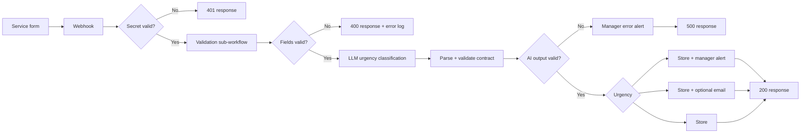
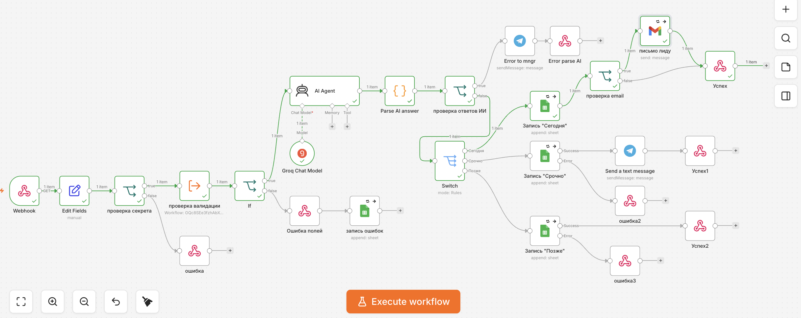
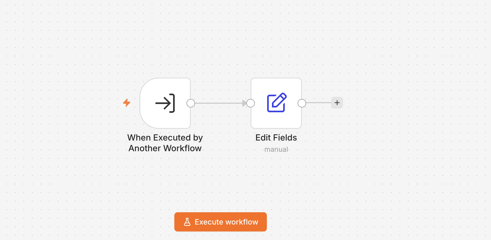

# AI Service Request Automation

A webhook-driven n8n system that validates appliance-repair requests, classifies urgency with a guarded LLM contract, and routes each request to an operationally appropriate response path.

[Main workflow](./workflows/ai-service-request-main.json) · [Validation sub-workflow](./workflows/validate-service-request.json) · [AI output example](./examples/sample-output.json) · [Test scenarios](./tests/TEST_CASES.md)

> Scope: portfolio demonstration. AI recommends urgency within three allowed values; deterministic validation, parsing, and routing remain outside the model.

## Business problem

Repair services receive a mixture of emergencies, same-day failures, and non-critical questions. Manual triage can delay leaks or electrical risks, while treating every request as urgent overloads dispatchers.

The intake layer must reject malformed requests, preserve the customer message, constrain the model's output, and make urgent cases visible immediately.

## Solution

The main workflow accepts query parameters and verifies a shared secret. A synchronous sub-workflow requires a name, a plausible phone format, and a non-empty request. Valid data reaches an AI Agent that returns one of three urgency categories with a reason and confidence.

A Code node strips accidental code fences, parses JSON, checks the allowed category set, and enforces confidence between `0` and `1`. A deterministic Switch then writes the request to Google Sheets. Urgent cases alert a manager in Telegram; same-day cases can send a customer email; lower-priority cases are stored and acknowledged.

## Architecture


```mermaid
flowchart LR
    Client[Service form] --> Hook[Webhook]
    Hook --> Auth{Secret valid?}
    Auth -->|No| R401[401 response]
    Auth -->|Yes| Sub[Validation sub-workflow]
    Sub --> Valid{Fields valid?}
    Valid -->|No| R400[400 response + error log]
    Valid -->|Yes| Agent[LLM urgency classification]
    Agent --> Parse[Parse + validate contract]
    Parse --> AIValid{AI output valid?}
    AIValid -->|No| Admin[Manager error alert]
    Admin --> R500[500 response]
    AIValid -->|Yes| Route{Urgency}
    Route --> Urgent[Store + manager alert]
    Route --> Today[Store + optional email]
    Route --> Later[Store]
    Urgent --> R200[200 response]
    Today --> R200
    Later --> R200
```

## Workflow screenshots / Output evidence

**Main workflow**



**Validation sub-workflow**



Synthetic request and model-result contracts: [`sample-input.json`](./examples/sample-input.json) and [`sample-output.json`](./examples/sample-output.json).

## Key engineering decisions

- Required-field and phone-format validation run before the model call.
- The model can choose only `🔴 срочно`, `🟡 сегодня`, or `🟢 можно позже`.
- AI JSON is parsed and validated in code before any category reaches the Switch.
- Confidence must be numeric and remain within `0–1`; malformed output becomes a visible error.
- Urgent cases add a manager notification, while same-day cases optionally confirm by email.
- All accepted categories are persisted to a common requests sheet.

## Input and output contract

**Trigger:** HTTP webhook using query parameters.

**Required input:** `name`, `phone`, `request`, and `secret`. Phone must match `7–20` characters from digits, whitespace, parentheses, plus, or hyphen.

**Optional input:** `email`.

**AI output:** strict JSON with `urgency`, `reason`, and numeric `confidence` from `0` to `1`.

**HTTP output:** `401` for invalid authentication, `400` for validation failure, `500` for invalid AI output or a configured write failure branch, and `200` for an accepted request.

**Business output:** request row in Google Sheets; Telegram manager alert for urgent requests; optional Gmail confirmation for same-day requests.

## Failure handling

- Invalid authentication stops before sub-workflow and model execution.
- Missing name or request and invalid phone return a reasoned validation error and are logged.
- Invalid AI JSON, unsupported urgency, or out-of-range confidence triggers an operator alert and `500` response.
- The urgent and later Sheets nodes expose configured error outputs with `500` responses.
- Side effects are sequential and are not compensated if a later notification fails.

## Repository structure

```text
07-ai-service-request-automation/
├── README.md
├── workflows/
│   ├── ai-service-request-main.json
│   └── validate-service-request.json
├── screenshots/
├── examples/
└── tests/TEST_CASES.md
```

## Setup

1. Import both workflow exports.
2. Configure Groq, Google Sheets, Telegram, and Gmail credentials in n8n.
3. Replace `YOUR_API_SECRET`, `YOUR_SERVICE_VALIDATION_WORKFLOW_ID`, `YOUR_GOOGLE_SHEET_ID`, `YOUR_TELEGRAM_CHAT_ID`, and any target sheet name.
4. Select the imported validation workflow in the Execute Workflow node.
5. Verify every urgency branch and malformed-model test before activation.

## Test scenarios

The manual suite covers authentication, missing fields, phone formats, each urgency, low confidence boundaries, unsupported categories, malformed JSON, optional email, and downstream failures. See [`tests/TEST_CASES.md`](./tests/TEST_CASES.md).

## Known limitations

- The API secret is supplied through a query parameter.
- The phone regex checks shape, not whether the number is real or reachable.
- AI urgency has no labeled evaluation set, human feedback loop, or calibrated decision threshold.
- There is no request idempotency, duplicate check, rate limit, or transactional outbox.
- Today, urgent, and later branches do not provide identical notification behavior.

## Production hardening path

- move to a versioned JSON API behind signed authentication and rate limiting;
- add idempotency storage and unique request identifiers;
- evaluate urgency classification against labeled safety-critical examples;
- define a low-confidence manual-review policy instead of accepting every valid score;
- queue notifications and add retries, dead-letter handling, and delivery status;
- centralize redacted error logging, metrics, alerts, and retention controls.

## Tech stack

`n8n` · `Webhook API` · `Groq` · `JavaScript` · `Google Sheets` · `Telegram Bot API` · `Gmail`

---

## Русская версия

Система принимает заявку на ремонт, проверяет обязательные поля и формат телефона, затем просит LLM выбрать одну из трёх категорий срочности. Ответ модели не передаётся дальше напрямую: отдельный Code node валидирует JSON, допустимое значение urgency и диапазон confidence.

После этого работает обычный Switch. Срочные заявки записываются и отправляются менеджеру, заявки «сегодня» могут получить email-подтверждение, менее срочные сохраняются без немедленного оповещения. Для production нужны идемпотентность, очередь уведомлений, оценка качества классификации и политика ручной проверки при низкой уверенности.
