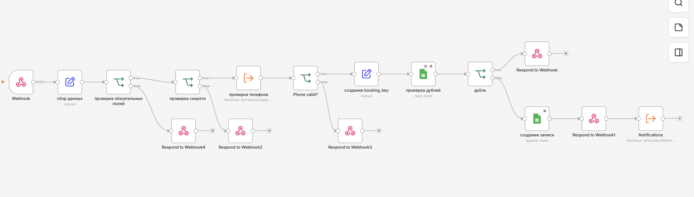
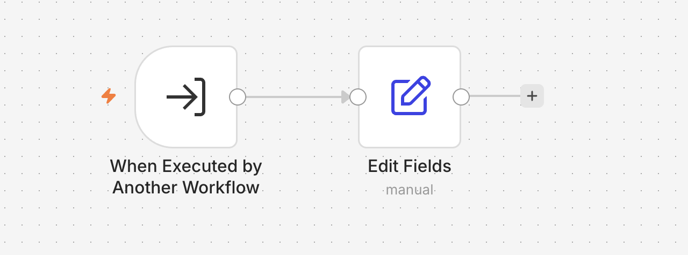
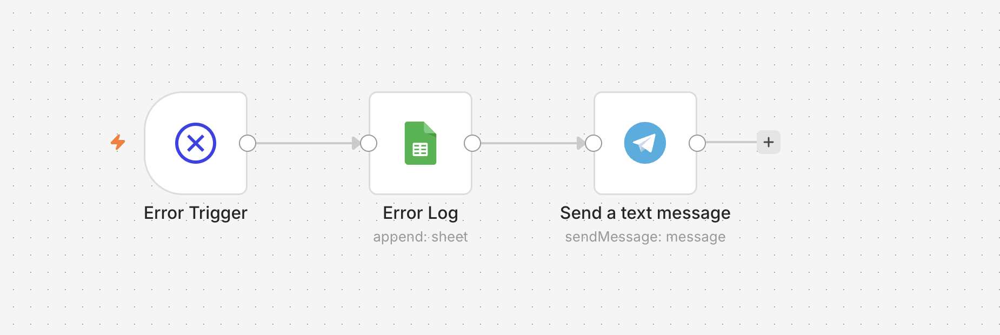

# Barbershop Booking API — n8n Automation

[Русский](#русская-версия) · [English](#english-version)

Модульная система записи клиентов в барбершоп на **n8n**, **Google Sheets**, **Telegram** и **Gmail**.

## Screenshots

### Main workflow



### Validation sub-workflow



### Notifications sub-workflow


### Error Handler workflow



---

## Русская версия

### О проекте

Система принимает заявку через Webhook, проверяет данные и секрет, нормализует телефон, предотвращает дубли, сохраняет запись в Google Sheets и запускает уведомления менеджеру и клиенту.

Проект разделён на четыре workflow:

| Workflow | Назначение |
|---|---|
| `barbershop-booking-api.json` | Основной API, проверки, защита от дублей и запись |
| `barbershop-validation.json` | Нормализация и проверка телефона |
| `barbershop-notifications.json` | Telegram и email-уведомления |
| `barbershop-error-handler.json` | Логирование и уведомление об ошибках |

### Архитектура

```mermaid
flowchart LR
    Client[Сайт / форма / API-клиент] -->|POST-запрос| Webhook

    subgraph API["Barbershop Booking API"]
        Webhook --> Collect[Сбор и очистка данных]
        Collect --> Required{Все обязательные поля есть?}
        Required -->|Нет| Missing[400 Missing fields]
        Required -->|Да| Secret{Секрет верный?}
        Secret -->|Нет| Unauthorized[401 Wrong secret]
        Secret -->|Да| Validation[Validation workflow]
        Validation --> Phone{Телефон валиден?}
        Phone -->|Нет| InvalidPhone[400 Invalid phone]
        Phone -->|Да| Key[Создание booking_key]
        Key --> Lookup[Поиск дубля в Google Sheets]
        Lookup --> Duplicate{Запись существует?}
        Duplicate -->|Да| Existing[200 Booking already exists]
        Duplicate -->|Нет| Append[Создание записи]
        Append --> Created[200 Booking created]
        Created -->|Без ожидания| Notifications
    end

    subgraph Notify["Notifications"]
        Notifications --> Telegram[Уведомление менеджеру]
        Telegram --> Email{Email валиден?}
        Email -->|Да| Gmail[Письмо клиенту]
    end

    subgraph Errors["Error Handler"]
        ErrorTrigger[Error Trigger] --> ErrorLog[Лог в Google Sheets]
        ErrorLog --> Alert[Аварийное сообщение в Telegram]
    end

    API -. Техническая ошибка .-> ErrorTrigger
    Notify -. Техническая ошибка .-> ErrorTrigger
```



Подробное описание: [`docs/ARCHITECTURE.md`](docs/ARCHITECTURE.md).

### Возможности

- приём `POST`-запросов через Webhook;
- проверка обязательных полей и API secret;
- нормализация российских номеров телефона;
- защита от дублей через `booking_key`;
- сохранение записей в Google Sheets;
- контролируемые HTTP-ответы;
- Telegram и email-уведомления;
- `Retry on Fail` для внешних интеграций;
- централизованный Error Workflow.

### `booking_key`

Ключ создаётся из телефона, услуги, мастера, даты и времени:

```text
+79781234567|haircut|alex|2026-07-20|15:00
```

Перед созданием новой строки workflow ищет такой ключ в Google Sheets. Повторный запрос не создаёт дубликат.

### API

```http
POST /webhook/barbershop-booking
```

Обязательные параметры:

```text
name, phone, service, master, date, time, secret
```

Необязательный параметр:

```text
email
```

Пример запроса:

```bash
curl --request POST \
  --url "https://YOUR_N8N_DOMAIN/webhook/barbershop-booking?name=Anna&phone=%2B79781234567&email=anna%40example.com&service=Haircut&master=Alex&date=2026-07-20&time=15%3A00&secret=YOUR_API_SECRET"
```

| Код | Ответ |
|---|---|
| `200` | `booking created` |
| `200` | `booking already exists` |
| `400` | `required fields are missing` |
| `400` | `invalid phone` |
| `401` | `wrong secret` |

### Установка

1. Импортировать JSON-файлы из папки [`workflows`](workflows).
2. Подключить Google Sheets, Telegram и Gmail credentials.
3. Заменить placeholders.
4. Выбрать нужные листы Google Sheets.
5. Назначить `Barbershop Error Handler` в `Settings → Error Workflow`.
6. Активировать основной API и Error Handler.

### Стек

- n8n
- Google Sheets
- Telegram Bot API
- Gmail
- Webhook / HTTP API
- JavaScript expressions
- Sub-workflows
- Error Workflow

### Ограничения

- секрет передаётся в query string, а не в header;
- POST-запрос читает query parameters, а не JSON body;
- проверка дублей через Google Sheets не атомарна;
- не проверяются рабочие часы и доступность мастера;
- перед production-запуском чувствительные данные в Error Log нужно маскировать.

### Возможные улучшения

- принимать JSON body и использовать `X-API-Key`;
- заменить Google Sheets на PostgreSQL/Supabase;
- добавить проверку расписания мастеров.

---

## English version

### Overview

A modular n8n booking automation that validates incoming requests, normalizes phone numbers, prevents duplicate bookings, stores records in Google Sheets, and sends manager and customer notifications.

The project consists of four workflows:

| Workflow | Purpose |
|---|---|
| `barbershop-booking-api.json` | Main API, validation flow, duplicate protection, and persistence |
| `barbershop-validation.json` | Phone normalization and validation |
| `barbershop-notifications.json` | Telegram and email notifications |
| `barbershop-error-handler.json` | Centralized error logging and alerts |

### Features

- POST webhook endpoint;
- required-field and secret validation;
- Russian phone normalization;
- deterministic `booking_key`;
- duplicate protection;
- Google Sheets persistence;
- explicit HTTP responses;
- asynchronous notifications;
- retry for external integrations;
- centralized Error Workflow.

### Setup

1. Import all JSON files from [`workflows`](workflows).
2. Configure Google Sheets, Telegram, and Gmail credentials.
3. Replace all placeholders.
4. Select the correct Google Sheets documents and sheets.
5. Set `Barbershop Error Handler` as the Error Workflow.
6. Activate the API and Error Handler workflows.

### Limitations

- The secret is passed in query parameters instead of a header.
- POST data is read from query parameters instead of a JSON body.
- Google Sheets duplicate checks are not atomic.
- Master availability and working hours are not validated.
- Sensitive error-log data should be masked before production use.
