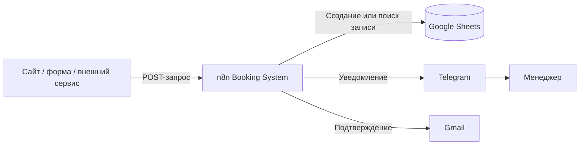
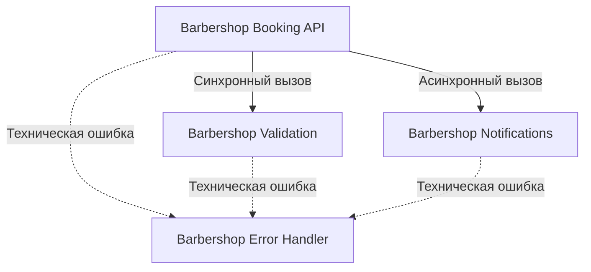
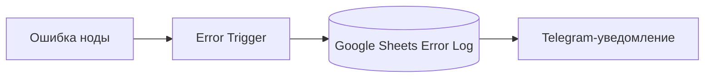
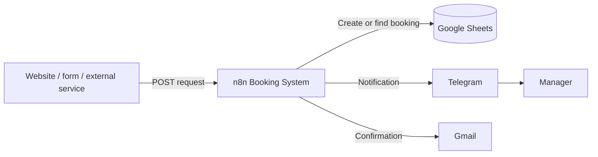
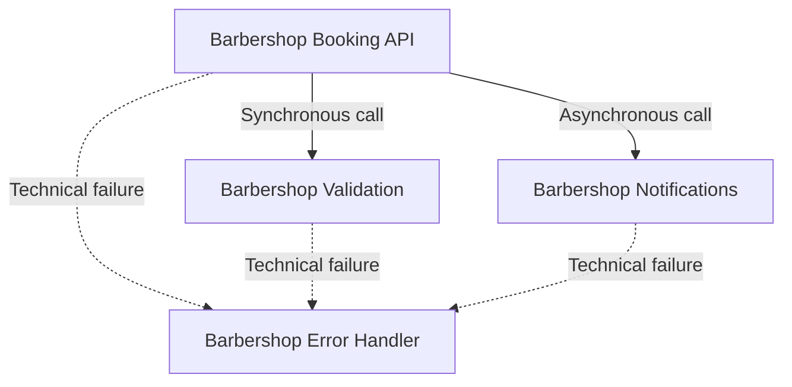

# Архитектура / Architecture

[Русский](#русская-версия) · [English](#english-version)

---

## Русская версия

### Общая схема



### Разделение workflow



### Путь запроса

1. Webhook принимает заявку.
2. Поля очищаются через `trim()`.
3. Проверяются обязательные значения.
4. Проверяется секрет.
5. Validation workflow нормализует и проверяет телефон.
6. Создаётся `booking_key`.
7. Google Sheets проверяется на наличие дубля.
8. Новая запись сохраняется в таблицу.
9. API возвращает ответ.
10. Notifications workflow запускается без ожидания завершения.

### Идемпотентность

Ключ создаётся по формуле:

```text
phone_normalized|service|master|date|time
```

Это защищает от повторной отправки формы и случайных дублей.

Ограничение: Google Sheets использует схему `сначала поиск → потом вставка`, поэтому при одновременных запросах теоретически возможна гонка. Для высокой нагрузки лучше использовать PostgreSQL/Supabase с уникальным индексом на `booking_key`.

### Синхронная часть

Клиент ждёт завершения проверки данных, валидации телефона, поиска дубля, создания записи и HTTP-ответа.

### Асинхронная часть

Клиент не ждёт Telegram- и email-уведомлений. Это ускоряет API-ответ и не делает создание записи зависимым от временной ошибки внешнего сервиса.

### Обработка ошибок

Ожидаемые бизнес-ошибки обрабатываются внутри API:

- отсутствуют поля;
- неверный секрет;
- некорректный телефон;
- запись уже существует.

Неожиданные технические ошибки передаются в Error Handler:



Перед production-запуском чувствительные данные в логах необходимо маскировать.

---

## English version

### System overview



### Workflow boundaries



### Request lifecycle

1. The Webhook receives a booking request.
2. Input fields are trimmed.
3. Required values and the API secret are checked.
4. The Validation workflow normalizes and validates the phone number.
5. A deterministic `booking_key` is generated.
6. Google Sheets is checked for a duplicate.
7. A new booking is stored.
8. The API returns a response.
9. The Notifications workflow starts without blocking the response.

### Idempotency

The key is generated as:

```text
phone_normalized|service|master|date|time
```

Google Sheets uses a non-atomic check-then-insert flow. For concurrent production workloads, PostgreSQL or Supabase with a unique constraint on `booking_key` would be safer.

### Error handling

Expected validation failures are handled inside the API. Unexpected technical failures are routed to the centralized Error Handler, logged in Google Sheets, and reported through Telegram.

Sensitive values should be masked before real production use.
