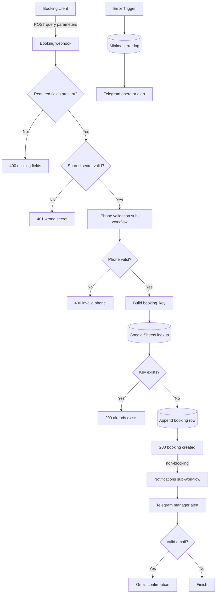
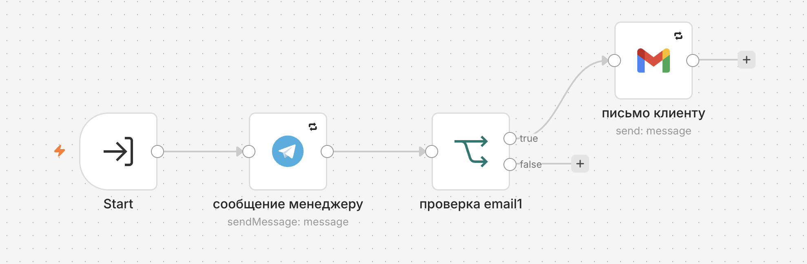

# Barbershop Booking API

A four-workflow n8n booking system that validates API requests, normalizes phone numbers, prevents ordinary retries from creating duplicate rows, responds synchronously, and dispatches notifications asynchronously.

[Main workflow](./workflows/barbershop-booking-api.json) · [Architecture notes](./docs/ARCHITECTURE.md) · [Sample request](./examples/sample-request.json) · [Test scenarios](./tests/TEST_CASES.md)

> Production-oriented demonstration and architecture flagship. The repository shows system boundaries, contracts, failure paths, and practical idempotency—but explicitly does not claim atomic booking or schedule availability control.

## Business problem

A booking endpoint sits between an external form and several operational systems. It must reject unauthorized or incomplete requests, normalize customer data, avoid duplicate records when a client retries, return quickly, and notify staff without making notification latency part of the API response time.

A single linear workflow can technically perform those steps, but it couples validation, persistence, delivery, and error reporting. That makes failures harder to isolate and increases the risk that a slow email or Telegram call delays the booking response.

## Solution

The main POST webhook trims query parameters and validates all required booking fields. It checks a shared secret, then calls a dedicated phone-validation sub-workflow that accepts common Russian number forms and returns a normalized value.

The workflow builds a deterministic `booking_key` from normalized phone, service, master, date, and time. Google Sheets is checked for that key before append. Existing keys return `booking already exists`; a new row returns `booking created`.

Only after the successful HTTP response does the main workflow start a non-blocking notifications sub-workflow. A separate n8n Error Workflow records minimal execution metadata and alerts an operator without copying the full input payload into the public log design.

## Architecture



The workflow split is intentional:

- **main API workflow** owns request validation, authentication, deduplication, persistence, and HTTP response;
- **phone validation workflow** owns one reusable normalization contract;
- **notifications workflow** owns best-effort delivery after the API response;
- **error workflow** owns operational visibility for unhandled execution failures.

See [`docs/ARCHITECTURE.md`](./docs/ARCHITECTURE.md) for boundary and failure-mode details.

## Workflow screenshots / Output evidence

**Main booking API workflow**


**Phone validation workflow**


**Notifications workflow**



**Error Handler workflow**


Synthetic API evidence: [`sample-request.json`](./examples/sample-request.json), [`sample-response-created.json`](./examples/sample-response-created.json), and [`sample-response-error.json`](./examples/sample-response-error.json).

## Key engineering decisions

- Required fields are checked before authentication-dependent and external operations.
- Phone validation is a synchronous sub-workflow with normalized output, not repeated expressions in the main path.
- `booking_key` is deterministic and stable across ordinary retries of the same booking request.
- Duplicate requests return `200`, making client retries operationally safe in the common sequential case.
- Persistence happens before the success response; notifications start after it and do not block the API client.
- Error logging stores workflow, node, description, and timestamp—not the complete request payload.
- Public exports are inactive and contain placeholders instead of credentials or instance resource IDs.

## Input and output contract

**Endpoint:** `POST /webhook/barbershop-booking` using query parameters in the current implementation.

**Required fields:**

| Field | Rule |
| --- | --- |
| `name` | non-empty after trim |
| `phone` | `8XXXXXXXXXX`, `7XXXXXXXXXX`, or `+7XXXXXXXXXX` |
| `service` | non-empty after trim |
| `master` | non-empty after trim |
| `date` | non-empty; semantic date validation is not implemented |
| `time` | non-empty; semantic time validation is not implemented |
| `secret` | exact match to configured shared secret |

`email` is optional and is used only for confirmation when its format is valid.

**Idempotency key:**

```text
normalized_phone|lowercase_service|lowercase_master|date|time
```

**HTTP responses:**

| Status | Body meaning |
| --- | --- |
| `200` | booking created |
| `200` | booking already exists |
| `400` | required fields are missing |
| `400` | invalid phone |
| `401` | wrong secret |

## Failure handling

- Validation and authentication failures return explicit client responses.
- The duplicate lookup and append nodes retry transient failures using n8n node settings.
- Notifications are invoked with `waitForSubWorkflow: false`; their latency does not delay the created response.
- Unhandled workflow failures can be attached to the included Error Workflow, which appends a minimal log row and alerts an operator.
- Full customer input is deliberately excluded from the error-handler log design.
- No compensating delete occurs if a booking is stored and a notification later fails.

## Repository structure

```text
08-barbershop-booking-api/
├── README.md
├── workflows/
│   ├── barbershop-booking-api.json
│   ├── barbershop-validation.json
│   ├── barbershop-notifications.json
│   └── barbershop-error-handler.json
├── docs/
│   ├── ARCHITECTURE.md
│   └── architecture.mmd
├── screenshots/
├── examples/
└── tests/TEST_CASES.md
```

## Setup

1. Import all four workflow exports.
2. Configure Google Sheets, Telegram, and Gmail credentials in n8n.
3. Replace `YOUR_API_SECRET`, `YOUR_GOOGLE_SHEET_ID`, `YOUR_GOOGLE_SHEET_NAME`, `YOUR_TELEGRAM_CHAT_ID`, `YOUR_BARBERSHOP_VALIDATION_WORKFLOW_ID`, and `YOUR_BARBERSHOP_NOTIFICATIONS_WORKFLOW_ID`.
4. Select the imported validation and notifications workflows in their Execute Workflow nodes.
5. Create sheet columns for the documented booking fields and `booking_key`.
6. Assign the imported error handler as the Error Workflow for relevant production workflows.
7. Run all success, retry, validation, and failure scenarios before activation.

## Test scenarios

The manual suite covers creation, sequential retry, missing fields, each accepted phone form, invalid phone, wrong secret, optional or invalid email, Sheets failure, notification failure, and concurrent duplicate risk. See [`tests/TEST_CASES.md`](./tests/TEST_CASES.md).

## Known limitations

- Google Sheets implements a **non-atomic check-then-insert**. Two concurrent identical requests can both pass lookup and create duplicate rows.
- The API accepts query parameters and a shared secret rather than a versioned JSON body and signed authentication.
- Date and time are checked only for presence; timezone, calendar validity, opening hours, and past dates are not validated.
- The workflow does not check a master calendar or prevent two different customers from booking the same slot.
- Notification delivery has no durable queue, delivery ledger, or retry dashboard.
- Google Sheets is not a transactional booking database.

## Production hardening path

- move bookings to PostgreSQL with a unique constraint on the idempotency key;
- accept a versioned JSON request body behind an API gateway with signed authentication and rate limiting;
- validate dates, timezone, service duration, opening hours, and master availability;
- reserve slots transactionally and define cancellation or rescheduling contracts;
- publish notification jobs through a durable outbox or queue with retries and dead-letter handling;
- add request IDs, structured redacted logs, metrics, traces, and operator runbooks;
- add automated contract, concurrency, and integration tests.

## Tech stack

`n8n` · `Webhook API` · `Google Sheets` · `Telegram Bot API` · `Gmail` · `JavaScript expressions`

---

## Русская версия

Это главный архитектурный кейс портфолио. Основной workflow отвечает за контракт API, проверку секрета, обязательные поля, нормализацию телефона, формирование `booking_key`, проверку дубля и запись. Уведомления вынесены в отдельный неблокирующий sub-workflow, а необработанные ошибки — в Error Workflow с минимальным журналированием.

Дедупликация полезна для обычного повторного запроса, но Google Sheets не даёт атомарной уникальности: два одновременных запроса всё ещё могут создать две строки. Также система пока не проверяет реальную доступность мастера и корректность слота. В production эти границы требуют базы с unique constraint, транзакционного бронирования и надёжной очереди уведомлений.
