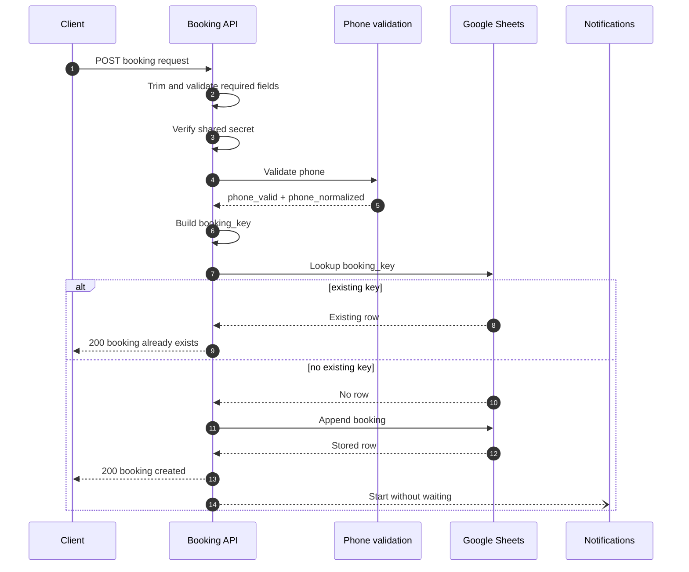
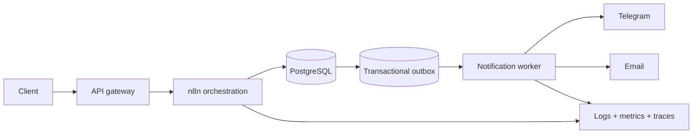

# Barbershop Booking API — Architecture Notes

This document explains the boundaries and failure behavior of the four public n8n workflows. It describes the current exports; it is not a claim that Google Sheets provides transactional booking guarantees.

[Case study](../README.md) · [Mermaid source](./architecture.mmd) · [Manual tests](../tests/TEST_CASES.md)

## System context

The system accepts a booking request from a form or API client and coordinates three categories of work:

1. synchronous API decisions that determine the HTTP response;
2. durable-enough portfolio persistence in Google Sheets;
3. best-effort operator and customer notifications.

The client receives a success response only after the booking row is found or appended. It does not wait for Telegram or Gmail delivery.

## Component boundaries

| Component | Owns | Does not own |
| --- | --- | --- |
| Booking API | input collection, required fields, authentication, idempotency key, lookup, append, HTTP response | availability planning, notification delivery |
| Phone validation | accepted Russian phone forms and normalized digits | identity verification, international numbering policy |
| Notifications | Telegram manager message and optional Gmail confirmation | booking persistence or API response |
| Error handler | minimal execution error record and operator alert | business compensation or replay |

This split reduces coupling: validation can be reused, notification latency stays outside the request path, and unexpected errors have a common destination.

## Main request sequence



## Request contract

The webhook is configured as `POST /barbershop-booking`. In the current implementation, fields are read from the query string even though the method is POST.

Required non-empty values are `name`, `phone`, `service`, `master`, `date`, `time`, and `secret`. `email` is optional.

Accepted phone forms are:

```text
8XXXXXXXXXX
7XXXXXXXXXX
+7XXXXXXXXXX
```

All accepted forms normalize to `7XXXXXXXXXX`.

The implementation checks only whether `date` and `time` are non-empty. It does not validate calendar semantics, timezone, opening hours, or availability.

## Idempotency model

The public workflow computes:

```text
phone_normalized
| service.trim().toLowerCase()
| master.trim().toLowerCase()
| date.trim()
| time.trim()
```

This makes an ordinary sequential retry return the existing-booking response instead of appending another row.

The guarantee is limited. Lookup and append are two separate Google Sheets operations. Without a database uniqueness constraint, concurrent identical requests can both observe no row and then both append. The design is retry-tolerant, not concurrency-safe.

## Persistence boundary

The booking row stores customer and slot fields plus `booking_key`. Google Sheets is used because it makes the portfolio workflow easy to inspect, but it is not treated as a transactional database.

The current design has no:

- unique index;
- row-level transaction;
- slot reservation lock;
- conflict check across different customers;
- audit event stream.

Production persistence should use a database transaction with a unique idempotency constraint and a separate constraint or reservation strategy for schedule slots.

## Notification boundary

After `booking created` is returned, the main workflow invokes Notifications with `waitForSubWorkflow: false`.

The notification workflow:

1. sends a Telegram manager message;
2. checks whether the optional email is present and syntactically valid;
3. sends a Gmail confirmation only when that check passes.

This reduces client latency and prevents email delay from changing a stored booking into an API timeout. The tradeoff is eventual notification: the booking can exist even if Telegram or Gmail fails.

## Error boundary

The Error Workflow records only:

- timestamp;
- workflow name;
- last executed node;
- error description.

It then sends the same operational context to a configured Telegram chat. The public design intentionally excludes the entire incoming payload and node-parameter dump to reduce accidental exposure of customer data or secrets.

This handler observes failures; it does not replay a request, delete a booking, or repair a notification.

## Failure-mode table

| Failure | Client-visible result | Persistent effect | Operator signal |
| --- | --- | --- | --- |
| Missing required field | `400` | none | execution history |
| Invalid secret | `401` | none | execution history |
| Invalid phone | `400` | none | execution history |
| Existing sequential retry | `200 already exists` | no new row | normal execution |
| Sheets lookup failure | request fails or times out | unknown until inspected | Error Workflow when assigned |
| Sheets append failure | request fails or times out | no confirmed row | Error Workflow when assigned |
| Telegram/Gmail failure | client already received `200 created` | booking remains | Error Workflow when assigned |
| Concurrent identical requests | both may receive created | duplicate rows possible | no deterministic alert |

## Security model

The repository contains no credentials and all exported workflows are inactive. Resource identifiers use `YOUR_*` placeholders.

The shared query-string secret is suitable only for demonstrating an authentication branch. Query values can appear in access logs and browser history. A production interface should use TLS, a request body, signed authentication or gateway-issued tokens, rate limiting, and secret rotation.

Customer fields are personal data. Production logs, retention, access control, and deletion procedures must be defined for the deployment jurisdiction and business policy.

## Production target

A stronger version would place an API gateway in front of n8n, persist bookings in PostgreSQL, and publish notification work through a transactional outbox:



The important change is not the number of components. It is the availability of enforceable uniqueness, atomic persistence, durable delivery, and measurable operations.

---

## Русская версия

Архитектура разделяет синхронный API-контур, валидацию телефона, уведомления и обработку ошибок. Клиент получает `booking created` после записи, а Telegram и Gmail запускаются отдельно и не увеличивают время ответа.

`booking_key` защищает от обычного последовательного повтора, но не от гонки двух одновременных запросов: Google Sheets не может атомарно выполнить проверку и вставку. Production-цель — база с unique constraint, транзакционная проверка слота и надёжная очередь уведомлений.
